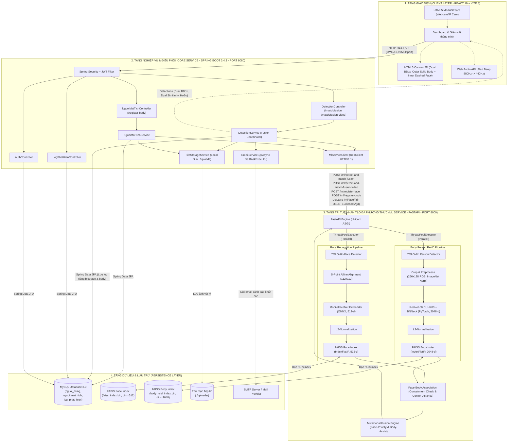
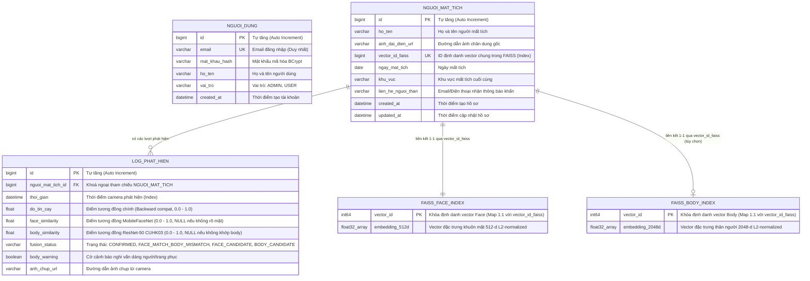
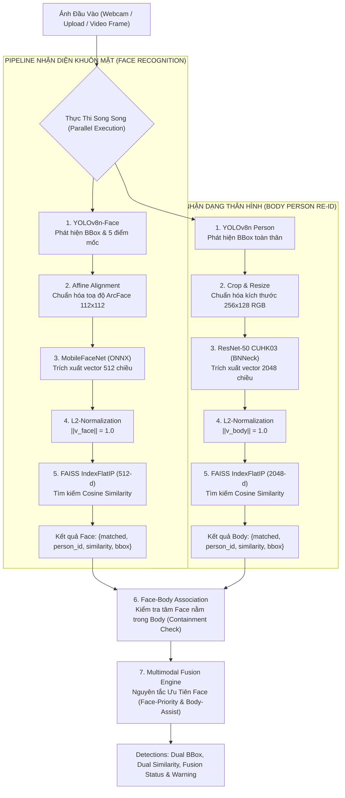
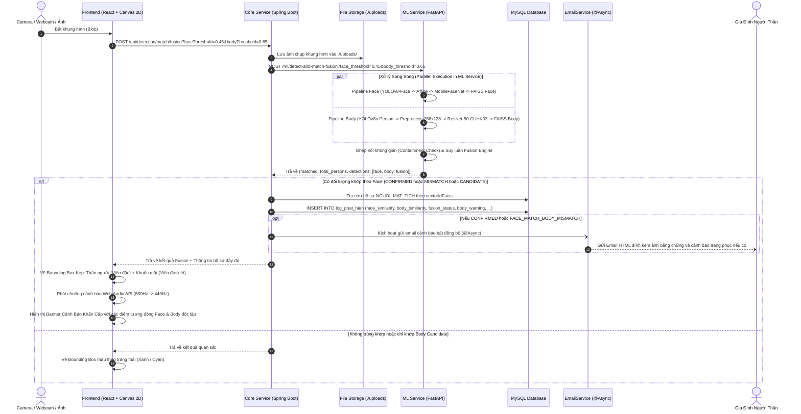
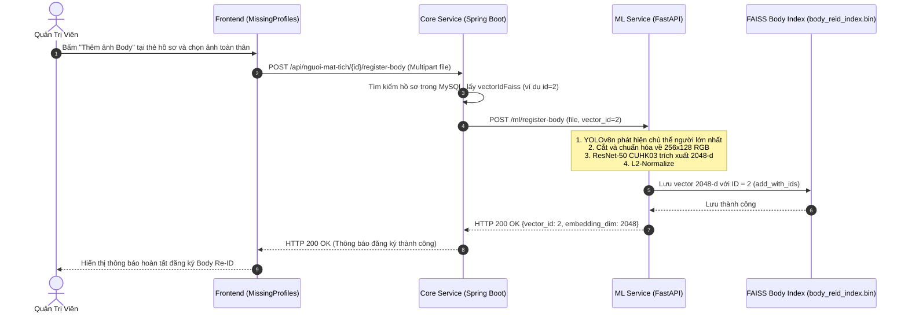

# KIẾN TRÚC HỆ THỐNG VÀ CÔNG NGHỆ SỬ DỤNG
## Hệ Thống Thông Báo Phát Hiện Người Mất Tích Bằng AI Đa Phương Thức (Multimodal Face & Body Re-ID Missing Persons Detection System)

---

## 1. Tổng Quan Hệ Thống (System Overview)

Hệ thống **Thông Báo Phát Hiện Người Mất Tích Bằng AI** là một giải pháp giám sát và tìm kiếm tự động, ứng dụng thị giác máy tính (Computer Vision) và học sâu (Deep Learning) kết hợp đa phương thức (**Multimodal Biometrics: Face Recognition + Body Person Re-Identification**) nhằm hỗ trợ gia đình và lực lượng chức năng phát hiện người mất tích qua camera an ninh hoặc ảnh chụp hiện trường theo thời gian thực.

### Các Tính Năng Trọng Tâm:
1. **Quản trị hồ sơ người mất tích:** Khai báo thông tin cá nhân, khu vực mất tích, thông tin liên hệ gia đình, đăng ký ảnh nhận dạng khuôn mặt (Face) và ảnh nhận dạng toàn thân (Body Re-ID).
2. **Nhận diện đa phương thức thời gian thực (Multimodal Real-time Fusion):**
   - **Khuôn mặt (Face Recognition):** Phát hiện qua YOLOv8n-Face, căn chỉnh 5 điểm mốc ArcFace (112×112) và trích xuất vector 512 chiều bằng MobileFaceNet.
   - **Dáng người & Trang phục (Body Person Re-ID):** Phát hiện qua YOLOv8n, căn chuẩn kích thước 256×128 RGB và trích xuất vector 2048 chiều bằng ResNet-50 CUHK03 (BNNeck).
   - **Lớp liên kết & Hợp nhất (Association & Fusion):** Liên kết Face-Body bằng kiểm tra hình học bao hàm (Containment Check), suy luận trạng thái kết hợp theo nguyên tắc **Ưu tiên Khuôn mặt (Face-Priority & Body-Assist)**.
3. **Cảnh báo khẩn cấp tức thì (Emergency Alert):** Kích hoạt âm thanh cảnh báo tần số sóng Sine trực tiếp trên giao diện giám sát, hiển thị banner khẩn cấp phân biệt độc lập độ tương đồng Face và Body, đồng thời tự động gửi email thông báo kèm ảnh bằng chứng tới người thân.
4. **Lưu trữ & Truy vết lịch sử (Audit Log):** Ghi nhận nhật ký chi tiết các sự kiện nhận diện (thời gian, hình ảnh chụp, `face_similarity`, `body_similarity`, `fusion_status`, `body_warning`).

---

## 2. Kiến Trúc Tổng Thể (System Architecture)

Hệ thống được thiết kế theo mô hình **Kiến trúc Microservices phân tán** kết hợp xử lý song song (Parallel Pipeline Processing) và xử lý bất đồng bộ (Asynchronous Event Processing).

### 2.1. Sơ Đồ Kiến Trúc Hệ Thống (Architecture Diagram)



---

## 3. Chi Tiết Các Tầng & Công Nghệ Sử Dụng

| Tầng (Tier) | Thành phần | Công nghệ / Thư viện chính | Phiên bản | Vai trò & Trách nhiệm kỹ thuật |
| :--- | :--- | :--- | :--- | :--- |
| **Frontend** | Ứng dụng Web Client | **React.js** | 19.2.8 | Xây dựng giao diện Single-Page Application (SPA), quản lý luồng giám sát thời gian thực, dual threshold sliders. |
| | Build Tool & Bundler | **Vite** | 8.3.0 | Môi trường phát triển HMR siêu tốc và đóng gói bundle tối ưu (ESM). |
| | Bộ Icon giao diện | **Lucide React** | 1.46.0 | Biểu tượng trực quan tinh gọn cho dashboard, webcam, video player và timeline pins. |
| | Thiết kế & Styling | **Vanilla CSS + Glassmorphism** | CSS3 | Dark Mode hiện đại, bảng màu HSL, hiệu ứng radar quét, không phụ thuộc thư viện CSS cồng kềnh. |
| | Xử lý Camera & Khung hình | **HTML5 MediaStream & Canvas API** | W3C Standard | Truy cập webcam, trích xuất khung hình video thời gian thực, vẽ Dual Bounding Box (Face viền đứt nét, Body viền đặc). |
| | Âm thanh cảnh báo | **Web Audio API** | W3C Standard | Tạo âm thanh cảnh báo tần số sóng Sine (880Hz -> 440Hz) tức thời không cần tải file âm thanh ngoài. |
| **Core Service** | Nền tảng Backend chính | **Java** | 17 (LTS) / 21 | Ngôn ngữ hướng đối tượng mạnh mẽ, an toàn kiểu dữ liệu cao. |
| | Web & IoC Framework | **Spring Boot** | 3.4.3 | Quản lý cấu hình, dependency injection, RESTful Web Services. |
| | Bảo mật & Xác thực | **Spring Security + JJWT** | 6.x / 0.12.6 | Xác thực phân quyền không trạng thái (Stateless Authentication) dựa trên JWT, mã hóa mật khẩu BCrypt. |
| | Tương tác CSDL | **Spring Data JPA & Hibernate** | 6.x | Quản lý thực thể ORM, tự động cập nhật schema (`ddl-auto: update`), phân tách trường `face_similarity` và `body_similarity`. |
| | Giao tiếp Service-to-Service | **Spring RestClient** | Spring 6+ | HTTP Client hiện đại kết nối sang FastAPI (Port 8000), cấu hình JDK HttpClient (HTTP/1.1), timeout 10 giây. |
| | Xử lý Bất đồng bộ | **Spring Task Execution (`@Async`)** | Spring Core | Cấu hình `mailTaskExecutor` để gửi email cảnh báo người thân mà không làm nghẽn luồng xử lý nhận diện. |
| | Gửi thông báo Email | **Spring Boot Starter Mail (JavaMailSender)** | Jakarta Mail | Soạn thảo email HTML cảnh báo khẩn cấp đính kèm hình ảnh hiện trường và thông tin người thân. |
| **ML Service** | Ngôn ngữ AI & Server | **Python** | 3.10 – 3.13 | Ngôn ngữ tiêu chuẩn trong học sâu và thị giác máy tính. |
| | Web API Framework | **FastAPI** | >= 0.110.0 | ASGI web framework hiệu năng cao, tự động sinh tài liệu Swagger/OpenAPI docs, xử lý bất đồng bộ. |
| | ASGI Web Server | **Uvicorn** | >= 0.28.0 | Web server bất đồng bộ chạy ứng dụng FastAPI. |
| | Phát hiện khuôn mặt | **YOLOv8n-Face (Ultralytics)** | >= 8.1.0 | Trích xuất Bounding Box khuôn mặt và 5 điểm mốc giải phẫu. File trọng số: `weights/yolov8n-face.pt`. |
| | Căn chỉnh khuôn mặt | **OpenCV (Affine Transformation)** | >= 4.9.0 | Phép biến đổi Affine đồng dạng 5 điểm mốc đưa khuôn mặt về chuẩn kích thước 112×112 ArcFace. |
| | Trích xuất vector khuôn mặt | **MobileFaceNet (InsightFace ArcFace)** | ONNX format | Mạng MobileFaceNet trích xuất vector 512 chiều từ ảnh 112×112. File trọng số: `weights/w600k_mbf.onnx`. |
| | Động cơ suy luận Face | **ONNX Runtime** | >= 1.17.0 | Thực thi suy luận CPUExecutionProvider tối ưu hóa tốc độ tính toán vector khuôn mặt. |
| | Phát hiện thân người | **YOLOv8n Person Detector (Ultralytics)** | >= 8.1.0 | Phát hiện vùng cơ thể người (class 0: person). File trọng số: `weights/yolov8n.pt`. |
| | Trích xuất vector thân hình | **ResNet-50 CUHK03 (BNNeck)** | PyTorch >= 2.0 | Kiến trúc ResNet-50 Re-ID sửa đổi stride Layer4=(1,1), GAP và BNNeck BatchNorm1d(2048). File trọng số: `weights/best_cuhk03_model_rerank.pth`. |
| | Cơ sở dữ liệu Vector | **Meta FAISS** | >= 1.8.0 | Tìm kiếm tương đồng vector Cosine (`IndexFlatIP` bọc trong `IndexIDMap2`):<br/>- `faiss_index.bin` (512 chiều - Face)<br/>- `body_reid_index.bin` (2048 chiều - Body) |
| **Data & Storage** | Cơ sở dữ liệu quan hệ | **MySQL Server** | 8.0+ | Lưu trữ thông tin tài khoản, hồ sơ người mất tích, lịch sử phát hiện với các trường đo lường độc lập. |
| | Lưu trữ tệp tin | **Local File System (`./uploads`)** | File System | Thư mục lưu trữ ảnh chân dung gốc, ảnh toàn thân và ảnh chụp camera thời điểm phát hiện. |

---

## 4. Thiết Kế Cơ Sở Dữ Liệu (Database Design)

Hệ thống ứng dụng mô hình **Hybrid Dual-Vector Persistence**: Cơ sở dữ liệu quan hệ (MySQL) lưu trữ dữ liệu nghiệp vụ có cấu trúc, song hành cùng **hai cơ sở dữ liệu Vector độc lập của FAISS** (Face Index 512-d và Body Index 2048-d). Hai cơ sở dữ liệu vector này dùng chung khóa định danh `vector_id_faiss` của hồ sơ người mất tích.

### 4.1. Sơ Đồ Thực Thể Quan Hệ (Entity Relationship Diagram - ERD)



### 4.2. Chi Tiết Các Bảng & Cấu Trúc Lưu Trữ

#### 1. Bảng `nguoi_mat_tich`
- Lưu trữ thông tin người thân cần tìm kiếm.
- Trường `vector_id_faiss` đóng vai trò là **khóa định danh duy nhất (Unique ID)** được chia sẻ đồng bộ giữa MySQL, `faiss_index.bin` (Face) và `body_reid_index.bin` (Body). Nhờ đó, khi một trong hai hoặc cả hai mô hình AI tìm thấy vector ID tương đồng, Core Service có thể truy vấn ngay lập tức hồ sơ người thân với độ phức tạp $O(1)$.

#### 2. Bảng `log_phat_hien` (Nhật ký phát hiện nâng cấp)
- **`do_tin_cay` (FLOAT):** Điểm tương đồng chính (ưu tiên điểm Face để duy trì tương thích ngược với API cũ).
- **`face_similarity` (FLOAT NULL):** Điểm tương đồng Cosine trích xuất từ MobileFaceNet (512 chiều). Giá trị `null` nếu khung hình không phát hiện được mặt (đối tượng quay lưng, cúi đầu).
- **`body_similarity` (FLOAT NULL):** Điểm tương đồng Cosine trích xuất từ mô hình ResNet-50 CUHK03 (2048 chiều). Giá trị `null` nếu không phát hiện được thân hình hoặc chưa đăng ký đặc trưng thân người.
- **`fusion_status` (VARCHAR(30)):** Chuỗi định danh trạng thái kết hợp (`CONFIRMED`, `FACE_MATCH_BODY_MISMATCH`, `FACE_CANDIDATE`, `BODY_CANDIDATE`, `UNKNOWN`).
- **`body_warning` (BOOLEAN):** Bật `true` khi khuôn mặt nhận diện chính xác người A nhưng dáng người/trang phục lại khớp với hồ sơ người B hoặc khác biệt hoàn toàn (báo hiệu người vận hành cần kiểm tra trang phục thay đổi).

---

## 5. Pipeline Xử Lý Trí Tuệ Nhân Tạo (AI Multimodal Pipeline)

Hệ thống vận hành song song hai pipeline thị giác máy tính độc lập thông qua `concurrent.futures.ThreadPoolExecutor(max_workers=2)` trong FastAPI, sau đó tiến hành ghép nối không gian hình học và suy luận trạng thái kết hợp:



### 5.1. Pipeline Khuôn Mặt (Face Recognition)
1. **Phát hiện:** YOLOv8n-Face phát hiện khuôn mặt và 5 điểm mốc (mắt trái, mắt phải, mũi, 2 khóe miệng).
2. **Căn chỉnh:** Phép biến đổi Affine đồng dạng (`cv2.estimateAffinePartial2D` & `cv2.warpAffine`) đưa khuôn mặt về chuẩn kích thước 112×112.
3. **Trích xuất:** MobileFaceNet (ONNX Runtime) sinh vector 512 chiều $\vec{v}_{face}$.
4. **Chuẩn hóa & So khớp:** Chuẩn hóa L2 và tìm kiếm tương đồng trên `FAISS IndexFlatIP(512)` với ngưỡng chuẩn $0.45$.

### 5.2. Pipeline Thân Người (Body Person Re-ID)
1. **Phát hiện:** YOLOv8n phát hiện các đối tượng người trong khung hình với bounding box toàn thân.
2. **Chuẩn hóa ảnh crop:**
   - Cắt vùng toàn thân theo Bounding Box.
   - Chuyển không gian màu BGR sang RGB.
   - Biến đổi kích thước về chuẩn **$256 \times 128$** (chiều cao 256, chiều rộng 128).
   - Chuẩn hóa theo phân phối chuẩn ImageNet:
     $$\mu = [0.485, 0.456, 0.406], \quad \sigma = [0.229, 0.224, 0.225]$$
3. **Trích xuất đặc trưng (Feature Extraction):**
   - Mô hình **ResNet-50 CUHK03** được sửa đổi stride tại Layer4 thành $(1, 1)$ nhằm bảo toàn độ phân giải không gian của feature map.
   - Qua tầng Adaptive Average Pooling (GAP) và tầng **BNNeck** (`BatchNorm1d(2048)`), sinh vector đặc trưng 2048 chiều: $\vec{v}_{body} \in \mathbb{R}^{2048}$.
4. **Chuẩn hóa & So khớp:**
   - Chuẩn hóa L2: $\|\hat{v}_{body}\|_2 = 1.0$.
   - Tìm kiếm tương đồng Cosine trên `FAISS IndexFlatIP(2048)` với ngưỡng cơ bản $0.65$.

### 5.3. Cơ Chế Ghép Nối Hình Học (Face-Body Association)
- Do hai mô hình chạy song song, hệ thống thu được $N$ khuôn mặt và $M$ thân người độc lập.
- Áp dụng thuật toán **Kiểm Tra Bao Hàm (Containment Check)**:
  - Một khuôn mặt được coi là thuộc về một thân người nếu tâm của khuôn mặt $(cx_{face}, cy_{face})$ nằm gọn trong bounding box của thân người:
    $$bx_1 \le cx_{face} \le bx_2 \quad \text{và} \quad by_1 \le cy_{face} \le by_2$$
  - Nếu có nhiều thân người cùng bao hàm một khuôn mặt (ví dụ đứng che khuất), hệ thống áp dụng tiêu chí khoảng cách tâm Euclid nhỏ nhất để chọn thân người tương ứng.
  - Trường hợp không có khuôn mặt nào nằm trong thân người: Xem xét như đối tượng quay lưng/che mặt (`face = null`).
  - Trường hợp khuôn mặt không nằm trong thân người nào: Xem xét như đối tượng chụp cận cảnh mặt (`body = null`).

### 5.4. Động Cơ Hợp Nhất Đa Phương Thức (Multimodal Fusion Engine)

> **Nguyên tắc cốt lõi: Ưu tiên Khuôn mặt (Face-Priority & Body-Assist)**  
> Khuôn mặt là đặc trưng sinh trắc học cá nhân đáng tin cậy nhất và không đổi trong thời gian ngắn. Trang phục và vóc dáng có thể thay đổi (thay áo khoác, mang balo, thay đổi tư thế) hoặc trùng lặp giữa nhiều người.  
> Do đó, **Body Re-ID chỉ đóng vai trò bổ trợ và tăng cường khả năng phát hiện**, tuyệt đối không phủ quyết kết quả của Face Recognition.  
> Hệ thống **loại bỏ hoàn toàn cơ chế xung đột hủy nhận diện (CONFLICT -> null)**.

| Face Recognition | Body Re-ID | Fusion Status | Kết Luận Định Danh | Cờ Body Warning | Ý nghĩa nghiệp vụ & Hành động |
|---|---|---|---|:---:|---|
| Khớp người $P_1$ | Khớp người $P_1$ | **CONFIRMED** | **$P_1$** | `false` | Khớp cả khuôn mặt và trang phục/dáng người — Độ tin cậy cao nhất. Kích hoạt chuông báo đỏ, hiển thị banner khẩn cấp, lưu log và gửi email cảnh báo. |
| Khớp người $P_1$ | Khớp người $P_2$ | **FACE_MATCH_BODY_MISMATCH** | **$P_1$** *(Ưu tiên Face)* | **`true`** | **Nhận dạng chính xác theo Face ($P_1$)**. Kích hoạt chuông báo, hiển thị banner màu cam kèm thông báo: *"Đã nhận diện theo khuôn mặt ($P_1$), cảnh báo nghi vấn trang phục/dáng người khớp hồ sơ $P_2$ (nghi vấn thay đổi áo hoặc đi cùng người khác)"*. Gửi email cảnh báo đính kèm cờ nghi vấn. |
| Khớp người $P_1$ | Không khớp / null | **FACE_CANDIDATE** | **$P_1$** | `false` | Nhận dạng theo khuôn mặt $P_1$ (trang phục mới hoặc chưa đăng ký ảnh body). Vẫn kích hoạt thông báo nhận dạng và lưu log như hệ thống gốc. |
| Không khớp / null | Khớp người $P_1$ | **BODY_CANDIDATE** | **$P_1$** | `false` | Đối tượng quay lưng hoặc che mặt, nhưng dáng người và trang phục khớp hồ sơ $P_1$. Giao diện hiển thị viền cyan và gợi ý người vận hành kiểm tra camera/ảnh thủ công. |
| Không khớp | Không khớp | **UNKNOWN** | `null` | `false` | Người lạ qua đường, không phát tín hiệu cảnh báo. |

---

## 6. Các Luồng Hoạt Động Chi Tiết (Detailed Workflows)

### 6.1. Luồng Nhận Diện Thời Gian Thực Đa Phương Thức (Multimodal Fusion Real-time Flow)



---

### 6.2. Luồng Đăng Ký Đặc Trưng Thân Hình Bổ Trợ (Body Feature Registration Flow)



---

## 7. Cấu Trúc Mã Nguồn Dự Án (Project Structure)

```text
person_detection/
├── ARCHITECTURE.md                  # Tài liệu kiến trúc hệ thống và công nghệ sử dụng
├── REID_INTEGRATION_PLAN.md          # Kế hoạch chi tiết và ma trận nghiệm thu tích hợp Re-ID
│
├── core-service/                    # BACKEND SERVICE (Java Spring Boot 3.4.3)
│   ├── pom.xml                      # Cấu hình Maven (Spring Security, JPA, Mail, JJWT)
│   ├── mvnw / mvnw.cmd              # Maven Wrapper
│   └── src/main/
│       ├── java/com/example/coreservice/
│       │   ├── CoreServiceApplication.java
│       │   ├── client/
│       │   │   └── MlServiceClient.java         # RestClient gọi FastAPI (cả Face và Fusion APIs)
│       │   ├── config/
│       │   │   ├── AsyncConfig.java             # Cấu hình ThreadPoolTaskExecutor (Email)
│       │   │   ├── DataInitializer.java        # Khởi tạo tài khoản ADMIN mặc định
│       │   │   ├── SecurityConfig.java          # Cấu hình CORS, CSRF, JWT Filter
│       │   │   └── WebConfig.java               # Phục vụ static file ảnh (/uploads/**)
│       │   ├── controller/
│       │   │   ├── AuthController.java          # API đăng nhập / xác thực JWT
│       │   │   ├── DetectionController.java     # API nhận diện Face (/match) & Fusion (/match/fusion)
│       │   │   ├── LogPhatHienController.java   # API xem lịch sử các lượt phát hiện
│       │   │   └── NguoiMatTichController.java  # CRUD hồ sơ & API /register-body
│       │   ├── dto/                             # Data Transfer Objects
│       │   │   ├── DetectionResponse.java       # DTO nhận diện Face gốc
│       │   │   ├── FusionDetectionResponse.java # DTO nhận diện Fusion thời gian thực
│       │   │   ├── FusionDetectionItemDto.java  # DTO từng đối tượng phát hiện (Face + Body + Fusion)
│       │   │   ├── FusionComponentResultDto.java# DTO chi tiết thành phần (Face hoặc Body)
│       │   │   ├── FusionStatusDto.java         # DTO trạng thái hợp nhất và cảnh báo nghi vấn
│       │   │   ├── FusionVideoDetectionResponse.java # DTO phân tích video Fusion
│       │   │   ├── FusionVideoPersonSummaryDto.java  # DTO tóm tắt từng người trong video
│       │   │   ├── FusionVideoTimelineItemDto.java   # DTO mốc thời gian xuất hiện trong video
│       │   │   ├── LogPhatHienResponse.java     # DTO lịch sử hiển thị faceSimilarity & bodySimilarity
│       │   │   └── MlFusion*.java               # Bộ DTO ánh xạ trực tiếp từ ML Service FastAPI
│       │   ├── entity/                          # Thực thể JPA
│       │   │   ├── NguoiMatTich.java            # Bảng nguoi_mat_tich
│       │   │   ├── LogPhatHien.java             # Bảng log_phat_hien (face_similarity, body_similarity, fusion_status, body_warning)
│       │   │   └── NguoiDung.java / VaiTro.java # Bảng nguoi_dung
│       │   ├── repository/                      # Spring Data JPA Repositories
│       │   ├── security/                        # JwtTokenProvider, JwtAuthenticationFilter
│       │   └── service/
│       │       ├── DetectionService.java        # Điều phối nhận diện Face & Fusion, ghi log độc lập
│       │       ├── EmailService.java            # Soạn thảo & gửi Email cảnh báo bất đồng bộ
│       │       ├── FileStorageService.java      # Lưu trữ tệp tin trên ổ cứng
│       │       └── NguoiMatTichService.java     # Quản trị hồ sơ & đồng bộ vector sang FAISS kép
│       └── resources/
│           └── application.yml                  # Cấu hình MySQL, SMTP, ML-Service URL, JWT Secret
│
├── ml-service/                      # AI / COMPUTER VISION SERVICE (Python FastAPI)
│   ├── requirements.txt             # Thư viện: FastAPI, PyTorch, Torchvision, YOLOv8, ONNX, FAISS
│   ├── run.py / start.bat           # Script khởi động Uvicorn ML Service
│   ├── weights/                     # Trọng số các mô hình học sâu
│   │   ├── yolov8n-face.pt          # Trọng số phát hiện khuôn mặt & 5 điểm mốc
│   │   ├── w600k_mbf.onnx           # Trọng số MobileFaceNet ArcFace (InsightFace, 512-d)
│   │   ├── yolov8n.pt               # Trọng số phát hiện thân người (Ultralytics YOLOv8n)
│   │   └── best_cuhk03_model_rerank.pth # Trọng số ResNet-50 CUHK03 Body Re-ID (BNNeck, 2048-d)
│   ├── data/                        # Cơ sở dữ liệu Vector lưu trữ vật lý
│   │   ├── faiss_index.bin          # CSDL vector khuôn mặt FAISS (IndexFlatIP, 512 chiều)
│   │   └── body_reid_index.bin      # CSDL vector thân người FAISS (IndexFlatIP, 2048 chiều)
│   └── app/
│       ├── main.py                  # Điểm khởi tạo FastAPI và định tuyến toàn bộ API endpoints
│       ├── detection.py             # Lớp YOLOv8FaceDetector (BBox + 5 Landmarks)
│       ├── alignment.py             # Hàm align_face_5point (Affine warp 112x112)
│       ├── embedding.py             # Lớp MobileFaceNetEmbedder (ONNX Runtime, 512-d)
│       ├── vector_store.py          # Lớp FaissVectorStore (IndexFlatIP + IndexIDMap2, 512-d)
│       ├── fusion.py                # Thuật toán Containment Association & Multimodal Fusion Engine
│       └── reid/                    # Gói mở rộng Body Person Re-ID
│           ├── __init__.py
│           ├── model.py             # Lớp BaselineReID (ResNet-50 stride=1 + GAP + BNNeck)
│           ├── body_detector.py     # Lớp YOLOv8BodyDetector (YOLOv8n)
│           ├── preprocessing.py     # Cắt và chuẩn hóa ảnh thân người (256x128 RGB ImageNet)
│           ├── embedder.py          # Lớp BodyReIDEmbedder (Trích xuất vector 2048 chiều L2-normalized)
│           ├── vector_store_body.py # Lớp BodyFaissVectorStore (IndexFlatIP + IndexIDMap2, 2048-d)
│           └── service.py           # Hàm thực thi pipeline Body Re-ID độc lập
│
└── frontend/                        # USER INTERFACE (React.js + Vite)
    ├── package.json                 # Phụ thuộc npm (React 19, Lucide-React, Vite 8)
    ├── vite.config.js               # Cấu hình Vite bundler
    ├── index.html                   # HTML template gốc
    └── src/
        ├── App.jsx                  # Quản lý điều hướng tab: Giám sát, Hồ sơ, Lịch sử
        ├── App.css / index.css      # Hệ thống CSS Design Tokens, Dual BBox styles, Dark Theme
        ├── services/
        │   └── api.js               # Đóng gói hàm gọi API: detectFace, detectFusion, detectFusionVideo, registerBody
        └── components/
            ├── Navbar.jsx           # Thanh điều hướng và nút đăng nhập/đăng xuất
            ├── LoginModal.jsx       # Modal đăng nhập tài khoản Quản trị viên
            ├── CameraMonitor.jsx    # Giám sát camera realtime, vẽ Dual Canvas, Dual Threshold Sliders, Banner Cảnh Báo
            ├── MissingProfiles.jsx  # Danh sách hồ sơ, modal thêm mới & modal đăng ký ảnh Body Re-ID
            └── DetectionLogs.jsx    # Bảng nhật ký phát hiện hiển thị độc lập điểm Face và Body
```

---

## 8. Các Điểm Nổi Bật Về Tối Ưu Hóa & Tính Ổn Định

1. **Bảo toàn 100% Hệ thống Face Baseline (Zero Regression):**
   - Mọi API cũ (`POST /api/detection/match`, `POST /api/detection/match-video`, `POST /ml/detect-and-match`) được giữ nguyên vẹn, đảm bảo tính liên tục của hệ thống ban đầu.
2. **Nguyên tắc Ưu tiên Face (Face-Priority & Body-Assist):**
   - Loại bỏ cơ chế xung đột gây hủy nhận diện vô danh (`CONFLICT -> null`).
   - Khi Face khớp $P_1$ và Body khớp $P_2$, hệ thống **vẫn nhận dạng chính xác theo Face ($P_1$)**, kích hoạt thông báo nhận dạng và gắn kèm cờ nghi vấn trang phục (`body_warning = true`, status: `FACE_MATCH_BODY_MISMATCH`) để cảnh báo người giám sát.
3. **Độc lập hai nguồn dữ liệu sinh trắc học:**
   - Điểm `face_similarity` và `body_similarity` luôn được lưu trữ, truyền tải và hiển thị độc lập trong MySQL, DTOs và UI card. Tuyệt đối không lấy `Math.max()` hay hòa trộn hai không gian vector khác biệt.
4. **Cô lập lỗi (Fault Isolation & Graceful Degradation):**
   - Nếu mô hình Re-ID gặp sự cố hoặc hồ sơ chưa đăng ký ảnh toàn thân, pipeline Body trả về danh sách rỗng mà không gây gián đoạn pipeline Face. Hệ thống tự động chuyển tiếp sang trạng thái `FACE_CANDIDATE` với độ chính xác khuôn mặt nguyên vẹn.
5. **Thực thi song song đa luồng (Parallel Multimodal Execution):**
   - FastAPI tận dụng `ThreadPoolExecutor(max_workers=2)` để chạy song song Face Detection và Body Detection. Tổng thời gian xử lý một khung hình chỉ bị giới hạn bởi pipeline lớn hơn (khoảng 300 – 450ms trên CPU tiêu chuẩn), duy trì luồng giám sát camera mượt mà.
6. **Xử lý Bất đồng bộ Không nghẽn (Non-blocking Asynchronous Operations):**
   - Tác vụ gửi email cảnh báo người thân (`EmailService.sendMissingPersonAlert`) chạy trên luồng nền `@Async("mailTaskExecutor")`, không làm ảnh hưởng đến tốc độ khung hình (FPS) của trạm giám sát.
