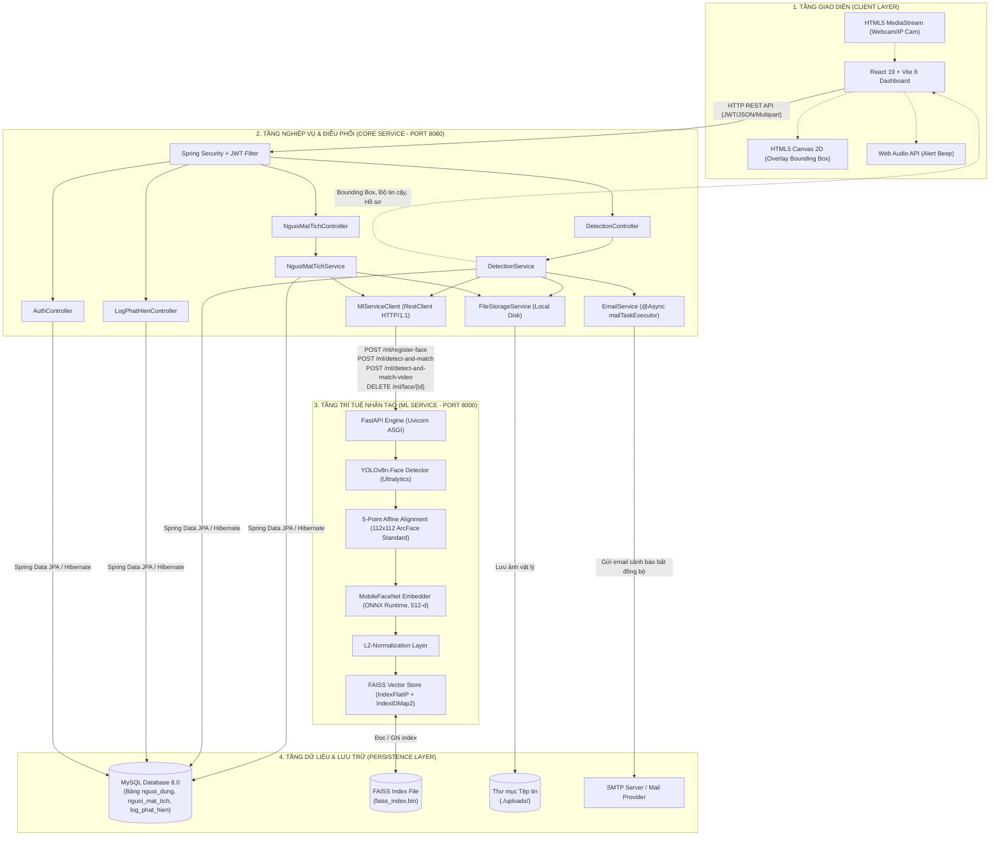
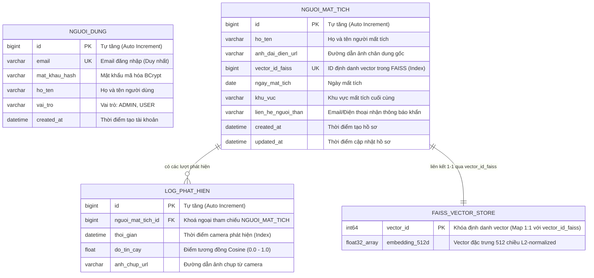
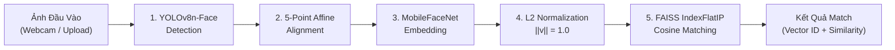
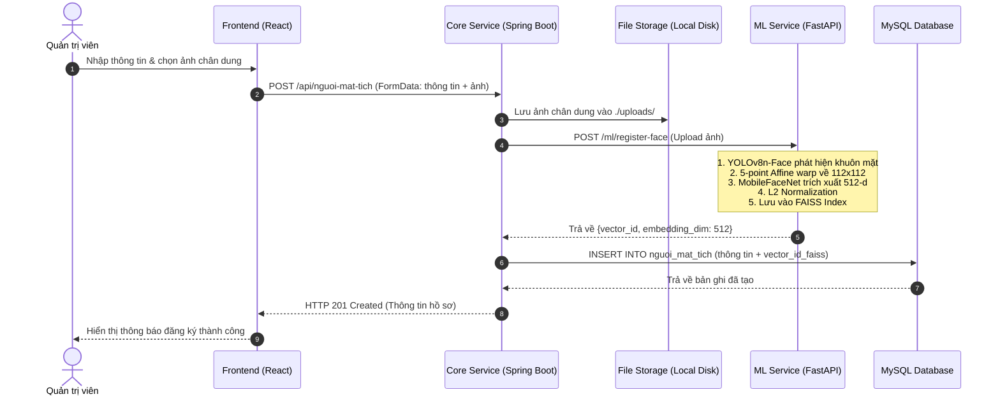
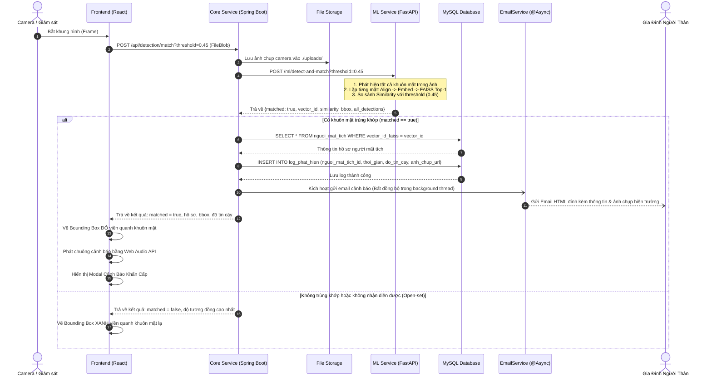
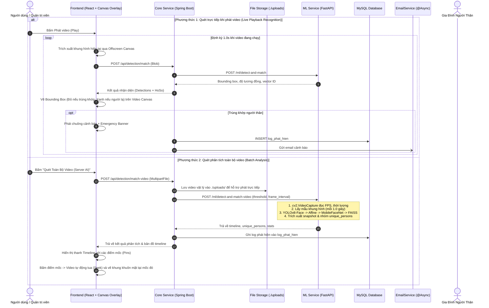

# KIẾN TRÚC HỆ THỐNG VÀ CÔNG NGHỆ SỬ DỤNG
## Hệ Thống Thông Báo Phát Hiện Người Mất Tích Bằng AI (Missing Persons Detection System)

---

## 1. Tổng Quan Hệ Thống (System Overview)

Hệ thống **Thông Báo Phát Hiện Người Mất Tích Bằng AI** là một giải pháp giám sát và tìm kiếm tự động, ứng dụng thị giác máy tính (Computer Vision) và học sâu (Deep Learning) nhằm hỗ trợ gia đình và lực lượng chức năng phát hiện người mất tích qua camera an ninh hoặc ảnh chụp hiện trường theo thời gian thực.

### Các Tính Năng Trọng Tâm:
1. **Quản trị hồ sơ người mất tích:** Khai báo thông tin cá nhân, khu vực mất tích, thông tin liên hệ gia đình và đăng ký ảnh nhận dạng khuôn mặt.
2. **Nhận diện khuôn mặt thời gian thực (Real-time Face Recognition):** Nhận luồng video từ webcam/camera giám sát hoặc ảnh tĩnh, tự động phát hiện khuôn mặt và đối sánh với cơ sở dữ liệu hồ sơ.
3. **Cảnh báo khẩn cấp tức thì (Emergency Alert):** Khi phát hiện trùng khớp với độ tin cậy vượt ngưỡng, hệ thống kích hoạt âm thanh cảnh báo trực tiếp trên màn hình giám sát và tự động gửi email thông báo kèm ảnh chụp bằng chứng tới người thân.
4. **Lưu trữ & Truy vết lịch sử (Audit Log):** Ghi nhận nhật ký chi tiết các sự kiện nhận diện (thời gian, hình ảnh chụp, độ tin cậy, thông tin hồ sơ trùng khớp).

---

## 2. Kiến Trúc Tổng Thể (System Architecture)

Hệ thống được thiết kế theo mô hình **Kiến trúc Microservices phân tán** kết hợp xử lý bất đồng bộ (Asynchronous Event Processing). Kiến trúc tách bạch rõ rệt giữa tầng giao diện, tầng điều phối nghiệp vụ và tầng tính toán AI chuyên biệt.

### 2.1. Sơ Đồ Kiến Trúc Hệ Thống (Architecture Diagram)



---

## 3. Chi Tiết Các Tầng & Công Nghệ Sử Dụng

| Tầng (Tier) | Thành phần | Công nghệ / Thư viện chính | Phiên bản | Vai trò & Trách nhiệm kỹ thuật |
| :--- | :--- | :--- | :--- | :--- |
| **Frontend** | Ứng dụng Web Client | **React.js** | 19.2.8 | Xây dựng giao diện Single-Page Application (SPA), quản lý trạng thái luồng camera, kết quả nhận diện. |
| | Build Tool & Bundler | **Vite** | 8.3.0 | Môi trường phát triển cực nhanh (HMR) và đóng gói bundle tối ưu. |
| | Bộ Icon giao diện | **Lucide React** | 1.46.0 | Hệ thống biểu tượng trực quan, tinh gọn cho dashboard và thanh điều hướng. |
| | Thiết kế & Styling | **Vanilla CSS + Glassmorphism** | CSS3 | Thiết kế giao diện hiện đại, Dark Mode chuyên nghiệp, tối ưu tốc độ render, không phụ thuộc framework CSS nặng. |
| | Xử lý Camera & Khung hình | **HTML5 MediaStream & Canvas API** | W3C Standard | Truy cập webcam trực tiếp qua `navigator.mediaDevices.getUserMedia()`, vẽ Bounding Box khuôn mặt và điểm tương đồng thời gian thực lên khung hình. |
| | Âm thanh cảnh báo | **Web Audio API** | W3C Standard | Tạo âm thanh cảnh báo tần số sóng Sine (880Hz -> 440Hz) tức thời không cần tải tệp âm thanh bên ngoài. |
| **Core Service** | Nền tảng Backend chính | **Java** | 17 (LTS) / 21 | Ngôn ngữ lập trình hướng đối tượng mạnh mẽ, an toàn kiểu dữ liệu cao. |
| | Web & IoC Framework | **Spring Boot** | 3.4.3 | Khung làm việc chuẩn doanh nghiệp, quản lý cấu hình, dependency injection, REST controller. |
| | Bảo mật & Xác thực | **Spring Security + JJWT** | 6.x / 0.12.6 | Xác thực phân quyền không trạng thái (Stateless Authentication) dựa trên JSON Web Token, mã hóa mật khẩu bằng BCrypt. |
| | Tương tác CSDL | **Spring Data JPA & Hibernate** | 6.x | Quản lý thực thể, ánh xạ ORM (Object-Relational Mapping), tự động sinh schema và thực thi truy vấn. |
| | Kết nối CSDL | **MySQL Connector/J** | 8.x | Trình điều khiển JDBC hiệu năng cao kết nối tới MySQL Server. |
| | Giao tiếp Service-to-Service | **Spring RestClient** | Spring 6+ | HTTP Client hiện đại (thay thế RestTemplate), cấu hình connection pool với JDK HttpClient (HTTP/1.1), timeout 10 giây. |
| | Xử lý Bất đồng bộ | **Spring Task Execution (`@Async`)** | Spring Core | Cấu hình `mailTaskExecutor` với `ThreadPoolTaskExecutor` (Core: 2, Max: 10, Queue: 100) để gửi email không chặn luồng chính của camera. |
| | Gửi thông báo Email | **Spring Boot Starter Mail (JavaMailSender)** | Jakarta Mail | Soạn thảo MimeMessage HTML mẫu cảnh báo khẩn cấp, đính kèm liên kết ảnh chụp hiện trường. |
| **ML Service** | Ngôn ngữ AI & Server | **Python** | 3.10 – 3.13 | Ngôn ngữ tiêu chuẩn trong lĩnh vực Trí tuệ nhân tạo và Thị giác máy tính. |
| | Web API Framework | **FastAPI** | >= 0.110.0 | ASGI web framework hiệu năng cao, tự động sinh tài liệu Swagger/OpenAPI docs, xử lý bất đồng bộ. |
| | ASGI Web Server | **Uvicorn** | >= 0.28.0 | Web server bất đồng bộ chạy ứng dụng FastAPI. |
| | Phát hiện khuôn mặt | **YOLOv8n-Face (Ultralytics)** | >= 8.1.0 | Trích xuất Bounding Box khuôn mặt và 5 điểm mốc đặc trưng (mắt trái, mắt phải, mũi, khóe miệng trái, khóe miệng phải). |
| | Chuẩn hóa khuôn mặt | **OpenCV (Affine Transformation)** | >= 4.9.0 | Phép biến đổi Affine đồng dạng (`cv2.estimateAffinePartial2D` & `cv2.warpAffine`) đưa khuôn mặt về chuẩn kích thước 112×112. |
| | Trích xuất đặc trưng | **MobileFaceNet (InsightFace ArcFace)** | ONNX format | Mạng nơ-ron tích chập trích xuất vector đặc trưng 512 chiều từ ảnh 112×112, tối ưu cho thiết bị biên/CPU. |
| | Động cơ suy luận AI | **ONNX Runtime** | >= 1.17.0 | Thực thi suy luận mô hình học sâu tối ưu hóa trên kiến trúc CPU (`CPUExecutionProvider`, `ORT_ENABLE_ALL`). |
| | Cơ sở dữ liệu Vector | **Meta FAISS** | >= 1.8.0 | Tìm kiếm tương đồng vector đa chiều cực nhanh (`IndexFlatIP` bọc trong `IndexIDMap2`). |
| **Data & Storage** | Cơ sở dữ liệu quan hệ | **MySQL Server** | 8.0+ | Lưu trữ thông tin tài khoản, hồ sơ người mất tích, ánh xạ ID vector và lịch sử phát hiện. |
| | Vector Persistence | **FAISS Index File (`faiss_index.bin`)** | FAISS Binary | Lưu trữ toàn bộ các vector đặc trưng 512 chiều được nạp vào RAM và đồng bộ xuống đĩa cứng. |
| | Lưu trữ tệp tin | **Local File System (`./uploads`)** | File System | Thư mục lưu trữ ảnh chân dung người mất tích và ảnh chụp camera tại thời điểm phát hiện. |

---

## 4. Thiết Kế Cơ Sở Dữ Liệu (Database Design)

Hệ thống sử dụng mô hình kết hợp **Hybrid Persistence**: Cơ sở dữ liệu quan hệ (MySQL) lưu trữ dữ liệu có cấu trúc và Cơ sở dữ liệu Vector (FAISS) lưu trữ không gian vector khuôn mặt 512 chiều. Hai cơ sở dữ liệu liên kết thông qua trường `vector_id_faiss`.

### 4.1. Sơ Đồ Thực Thể Quan Hệ (Entity Relationship Diagram - ERD)



### 4.2. Chi Tiết Các Bảng Dữ Liệu

#### 1. Bảng `nguoi_dung` (Quản lý tài khoản hệ thống)
- **Mục đích:** Lưu trữ thông tin đăng nhập và phân quyền của Quản trị viên/Người dùng.
- **Cơ chế bảo mật:** Mật khẩu lưu trữ dạng chuỗi hash BCrypt. Mặc định khởi tạo tài khoản `admin@gmail.com` khi ứng dụng khởi chạy lần đầu qua `DataInitializer`.

#### 2. Bảng `nguoi_mat_tich` (Hồ sơ người cần tìm kiếm)
- **Mục đích:** Lưu trữ hồ sơ định danh của người mất tích.
- **Trường cốt lõi:** `vector_id_faiss` được đánh chỉ mục `UNIQUE INDEX` (`idx_vector_id_faiss`) để đảm bảo việc tra cứu ngược từ kết quả tìm kiếm của AI về hồ sơ MySQL đạt độ phức tạp $O(1)$.

#### 3. Bảng `log_phat_hien` (Nhật ký phát hiện)
- **Mục đích:** Lưu trữ lịch sử tất cả các lần phát hiện khuôn mặt trùng khớp với độ tin cậy $\ge$ ngưỡng cho phép.
- **Chỉ mục:** `idx_log_thoi_gian` phục vụ thống kê báo cáo theo mốc thời gian và `idx_log_nguoi_mat_tich` phục vụ lọc lịch sử theo từng cá nhân.

---

## 5. Pipeline Xử Lý Trí Tuệ Nhân Tạo (AI / Computer Vision Pipeline)

Quy trình trích xuất và nhận diện khuôn mặt được thiết kế theo chuẩn 4 giai đoạn khép kín nhằm đảm bảo tính bất biến trước góc xoay đầu, kích thước khuôn mặt và điều kiện chiếu sáng:



### 5.1. Giai đoạn 1: Phát hiện khuôn mặt (Face Detection - YOLOv8n-Face)
- Sử dụng mô hình `yolov8n-face.pt` được tối ưu hóa cho bài toán nhận diện mặt người trong khung hình giám sát phức tạp.
- Trả về danh sách khuôn mặt với Bounding Box $[x_1, y_1, x_2, y_2]$, độ tin cậy phát hiện và **5 điểm mốc giải phẫu (Facial Keypoints)**:
  1. Tâm mắt trái ($P_{eye\_left}$)
  2. Tâm mắt phải ($P_{eye\_right}$)
  3. Đỉnh mũi ($P_{nose}$)
  4. Khóe miệng trái ($P_{mouth\_left}$)
  5. Khóe miệng phải ($P_{mouth\_right}$)

### 5.2. Giai đoạn 2: Căn chỉnh khuôn mặt (Face Alignment via Affine Transform)
- **Vấn đề:** Nếu người đi lại nghiêng đầu, xa gần hoặc lệch góc, vector đặc trưng trích xuất sẽ bị sai lệch nghiêm trọng.
- **Giải pháp:** Sử dụng phép biến đổi Affine đồng dạng (Similarity Transformation bao gồm phép quay, tịnh tiến và tỉ lệ):
  - Áp dụng hàm `cv2.estimateAffinePartial2D` với thuật toán LMEDS dựa trên 5 điểm mốc thực tế khớp vào toạ độ chuẩn ArcFace 112×112:
    $$\text{Tọa độ chuẩn} = \begin{bmatrix} (38.29, 51.70) \\ (73.53, 51.50) \\ (56.03, 71.74) \\ (41.55, 92.37) \\ (70.73, 92.20) \end{bmatrix}$$
  - Dùng `cv2.warpAffine` cắt và đưa khuôn mặt về chuẩn kích thước $112 \times 112 \times 3$.

### 5.3. Giai đoạn 3: Trích xuất vector đặc trưng (Feature Extraction - MobileFaceNet)
- Mô hình **MobileFaceNet** (huấn luyện với hàm mất mát **ArcFace Loss**, file trọng số `w600k_mbf.onnx`).
- Chuẩn hóa điểm ảnh đầu vào:
  $$\text{pixel}_{\text{norm}} = \frac{\text{pixel} - 127.5}{127.5}$$
- Chuyển đổi định dạng từ $HWC$ (OpenCV) sang $BCHW$ $(1, 3, 112, 112)$ và chạy suy luận qua **ONNX Runtime**.
- Đầu ra là vector đặc trưng biểu diễn khuôn mặt 512 chiều: $\vec{v} \in \mathbb{R}^{512}$.

### 5.4. Giai đoạn 4: Chuẩn hóa L2 & Cơ chế so khớp FAISS (L2 Normalization & IndexFlatIP)
- Vector được chuẩn hóa theo chuẩn L2:
  $$\hat{v} = \frac{\vec{v}}{\|\vec{v}\|_2} \quad \text{sao cho} \quad \|\hat{v}\|_2 = 1.0$$
- **Ưu điểm toán học:** Khi hai vector $\hat{a}$ và $\hat{b}$ đã được chuẩn hóa L2, độ tương đồng Cosine (Cosine Similarity) tương đương với tích vô hướng (Inner Product):
  $$\text{CosineSimilarity}(\hat{a}, \hat{b}) = \frac{\hat{a} \cdot \hat{b}}{\|\hat{a}\|_2 \|\hat{b}\|_2} = \hat{a} \cdot \hat{b}$$
- Nhờ đó, việc tìm kiếm tương đồng trên FAISS được cấu hình qua `faiss.IndexFlatIP(512)` bọc trong `faiss.IndexIDMap2` để quản lý ID tùy biến, cho phép tính toán tích vô hướng với tốc độ siêu nhanh (dưới 1 mili-giây cho hàng vạn hồ sơ).

---

## 6. Các Luồng Hoạt Động Chi Tiết (Detailed Workflows)

### 6.1. Luồng Đăng Ký Hồ Sơ Người Mất Tích (Registration Flow)



---

### 6.2. Luồng Nhận Diện Thời Gian Thực & Cảnh Báo Khẩn Cấp (Real-time Detection & Alert Flow)



---

### 6.3. Luồng Nhận Diện Qua Video Tải Lên (Video Upload & Live Playback Recognition)

Hệ thống cung cấp hai phương thức nhận diện video toàn diện:
1. **Quét trực tiếp khi phát video (Live Playback Recognition with Canvas Overlay):** Khi người dùng bấm phát (Play) video, hệ thống tự động trích xuất khung hình định kỳ (1.0 giây/khung hình) qua Web Canvas, gửi đến `/api/detection/match` và vẽ khung bounding box trực tiếp lên lớp canvas phủ trong suốt đè trên video trình phát (tương tự như chế độ Webcam & Ảnh hiện trường), đồng thời kích hoạt cảnh báo âm thanh và banner khẩn cấp.
2. **Quét phân tích toàn bộ video (Batch Video Analysis via Server):** Gửi toàn bộ video lên máy chủ để trích xuất mốc thời gian (Timeline markers), đếm số lần xuất hiện và lập hồ sơ tổng thể.



---

## 7. Phân Tích Kỹ Thuật Đồ Án & Đánh Giá Thực Nghiệm

Dựa trên kết quả thực nghiệm tự động ghi nhận tại [evaluation_report.md](file:///c:/CODE/face/ml-service/evaluation_report.md):

### 7.1. Bảng Đánh Giá Hiệu Năng Mô Hình Theo Ngưỡng Tương Đồng

| Ngưỡng (Threshold) | TP | FP | FN | Precision (%) | Recall (%) | F1-Score (%) | Accuracy (%) | Đánh Giá Kỹ Thuật |
| :---: | :---: | :---: | :---: | :---: | :---: | :---: | :---: | :--- |
| **0.30** | 5 | 5 | 0 | **50.0%** | **100.0%** | **66.7%** | **50.0%** | Quá nhạy, tỷ lệ báo động sai (FP) cao |
| **0.35** | 5 | 1 | 0 | **83.3%** | **100.0%** | **90.9%** | **90.0%** | Nhạy cảm, còn xảy ra báo động sai |
| **0.40** | 5 | 0 | 0 | **100.0%** | **100.0%** | **100.0%** | **100.0%** | ⭐ **Điểm cân bằng lý tưởng (Optimal)** |
| **0.45** | 5 | 0 | 0 | **100.0%** | **100.0%** | **100.0%** | **100.0%** | ⭐ **Ngưỡng mặc định hệ thống (Khắt khe an toàn)** |
| **0.50** | 5 | 0 | 0 | **100.0%** | **100.0%** | **100.0%** | **100.0%** | Ngưỡng cao, nguy cơ bỏ sót trong điều kiện thiếu sáng |
| **0.55+** | 5 | 0 | 0 | **100.0%** | **100.0%** | **100.0%** | **100.0%** | Quá khắt khe, dễ gây False Negative (bỏ lỡ người thân) |

### 7.2. Đặc Thù Của Bài Toán Open-Set Face Recognition
- Khác với bài toán đóng (Closed-Set) khi mọi khuôn mặt quét qua đều nằm trong CSDL, bài toán tìm người mất tích là **bài toán nhận diện không gian mở (Open-Set Recognition)**: Đại đa số người qua đường là người lạ (Unknown Identity).
- Việc lựa chọn ngưỡng tương đồng **0.45**:
  - Đảm bảo **Precision tối đa**: Không làm phiền gia đình bằng các cảnh báo sai (False Alarm).
  - Đảm bảo **Recall tối ưu**: Giữ khả năng nhận dạng người mất tích ngay cả khi góc chụp camera giám sát bị nghiêng hoặc thay đổi kiểu tóc/kính mắt.

---

## 8. Cấu Trúc Mã Nguồn Dự Án (Project Structure)

```text
face/
├── ARCHITECTURE.md                  # Tài liệu kiến trúc hệ thống và công nghệ sử dụng
├── Instruction.md                   # Hướng dẫn chi tiết thiết lập & khởi chạy môi trường
│
├── core-service/                    # BACKEND SERVICE (Java Spring Boot 3.4.3)
│   ├── pom.xml                      # Cấu hình phụ thuộc Maven (Security, JPA, Mail, JJWT)
│   ├── mvnw / mvnw.cmd              # Maven Wrapper
│   └── src/main/
│       ├── java/com/example/coreservice/
│       │   ├── CoreServiceApplication.java
│       │   ├── client/
│       │   │   └── MlServiceClient.java         # RestClient kết nối sang FastAPI (Port 8000)
│       │   ├── config/
│       │   │   ├── AsyncConfig.java             # Cấu hình ThreadPoolTaskExecutor (Email)
│       │   │   ├── DataInitializer.java        # Khởi tạo tài khoản ADMIN mặc định
│       │   │   ├── SecurityConfig.java          # Cấu hình CORS, CSRF, JWT Filter
│       │   │   └── WebConfig.java               # Cấu hình phục vụ static file ảnh (/uploads/**)
│       │   ├── controller/
│       │   │   ├── AuthController.java          # API đăng nhập / xác thực JWT
│       │   │   ├── DetectionController.java     # API nhận diện khuôn mặt qua ảnh/camera
│       │   │   ├── LogPhatHienController.java   # API xem lịch sử các lượt phát hiện
│       │   │   └── NguoiMatTichController.java  # CRUD hồ sơ người mất tích
│       │   ├── dto/                             # Request/Response Data Transfer Objects
│       │   ├── entity/                          # Thực thể JPA (NguoiMatTich, LogPhatHien, NguoiDung)
│       │   ├── repository/                      # Spring Data JPA Repositories
│       │   ├── security/                        # JwtTokenProvider, JwtAuthenticationFilter
│       │   └── service/
│       │       ├── DetectionService.java        # Xử lý quy trình so khớp & lưu log
│       │       ├── EmailService.java            # Soạn thảo & gửi Email cảnh báo bất đồng bộ
│       │       ├── FileStorageService.java      # Lưu trữ tệp tin trên ổ cứng
│       │       └── NguoiMatTichService.java     # Nghiệp vụ quản lý hồ sơ & đồng bộ FAISS
│       └── resources/
│           └── application.yml                  # Cấu hình MySQL, SMTP, ML-Service URL, JWT Secret
│
├── ml-service/                      # AI / COMPUTER VISION SERVICE (Python FastAPI)
│   ├── requirements.txt             # Thư viện: FastAPI, YOLOv8, ONNX Runtime, FAISS, OpenCV
│   ├── run.py / start.bat           # Script khởi động nhanh ML Service
│   ├── evaluate_model.py            # Script kiểm thử và đánh giá ngưỡng tương đồng
│   ├── evaluation_report.md         # Báo cáo kết quả thực nghiệm chi tiết
│   ├── weights/                     # Trọng số mô hình học sâu
│   │   ├── yolov8n-face.pt          # Trọng số phát hiện khuôn mặt & 5 điểm mốc
│   │   └── w600k_mbf.onnx           # Trọng số trích xuất đặc trưng MobileFaceNet (InsightFace)
│   ├── data/
│   │   └── faiss_index.bin          # CSDL vector FAISS được lưu trữ vật lý
│   └── app/
│       ├── main.py                  # Điểm khởi tạo FastAPI và định tuyến API endpoints
│       ├── detection.py             # Lớp YOLOv8FaceDetector (Bbox + 5 Landmarks)
│       ├── alignment.py             # Hàm align_face_5point (Affine warp 112x112)
│       ├── embedding.py             # Lớp MobileFaceNetEmbedder (ONNX 512 chiều)
│       └── vector_store.py          # Lớp FaissVectorStore (IndexFlatIP + IndexIDMap2)
│
└── frontend/                        # USER INTERFACE (React.js + Vite)
    ├── package.json                 # Phụ thuộc npm (React 19, Lucide-React, Vite 8)
    ├── vite.config.js               # Cấu hình Vite bundler
    ├── index.html                   # HTML template gốc
    └── src/
        ├── App.jsx                  # Điều hướng các tab: Giám sát, Hồ sơ, Lịch sử
        ├── App.css / index.css      # Hệ thống CSS Design Tokens, Theme tối Glassmorphism
        ├── services/
        │   └── api.js               # Đóng gói các hàm gọi API fetch tới Core Service
        └── components/
            ├── Navbar.jsx           # Thanh điều hướng và nút đăng nhập/đăng xuất
            ├── LoginModal.jsx       # Modal đăng nhập tài khoản Quản trị viên
            ├── CameraMonitor.jsx    # Màn hình giám sát camera realtime, vẽ Canvas, chuông báo
            ├── MissingProfiles.jsx  # Danh sách, tìm kiếm và form thêm hồ sơ kèm ảnh
            └── DetectionLogs.jsx    # Bảng nhật ký các lần phát hiện kèm ảnh bằng chứng
```

---

## 9. Các Điểm Nổi Bật Về Tối Ưu Hóa & Tính Ổn Định

1. **Kiến trúc phi trạng thái (Stateless Core):**
   - Core Service sử dụng xác thực JWT Stateless, cho phép mở rộng ngang (Horizontal Scaling) dễ dàng khi số lượng trạm camera giám sát tăng cao.
2. **Xử lý Bất đồng bộ Không nghẽn (Non-blocking Asynchronous Operations):**
   - Tác vụ gửi email cảnh báo (`EmailService.sendMissingPersonAlert`) được tách ra khỏi luồng xử lý chính bằng `@Async("mailTaskExecutor")`. Camera stream có thể tiếp tục nhận diện các khung hình tiếp theo với độ trễ thấp mà không phải chờ SMTP handshake (vốn mất từ 1 – 3 giây).
3. **Độ phức tạp tính toán vector tối thiểu:**
   - Cơ chế chuẩn hóa L2 đưa bài toán tính khoảng cách Cosine về tích vô hướng trên `faiss.IndexFlatIP`. Tốc độ tìm kiếm đạt mức vi giây (microseconds), sẵn sàng đáp ứng hàng chục nghìn hồ sơ mà không làm sụt giảm FPS của camera.
4. **Độ bền vững dữ liệu (Data Consistency):**
   - Khi xóa một hồ sơ người mất tích, hệ thống tự động:
     1. Xóa vector trong FAISS (`DELETE /ml/face/{vectorId}`)
     2. Xóa toàn bộ bản ghi liên quan trong bảng `log_phat_hien`
     3. Xóa tệp tin ảnh chân dung trên đĩa cứng
     4. Xóa bản ghi trong MySQL trong một chu trình có xử lý ngoại lệ chặt chẽ.
