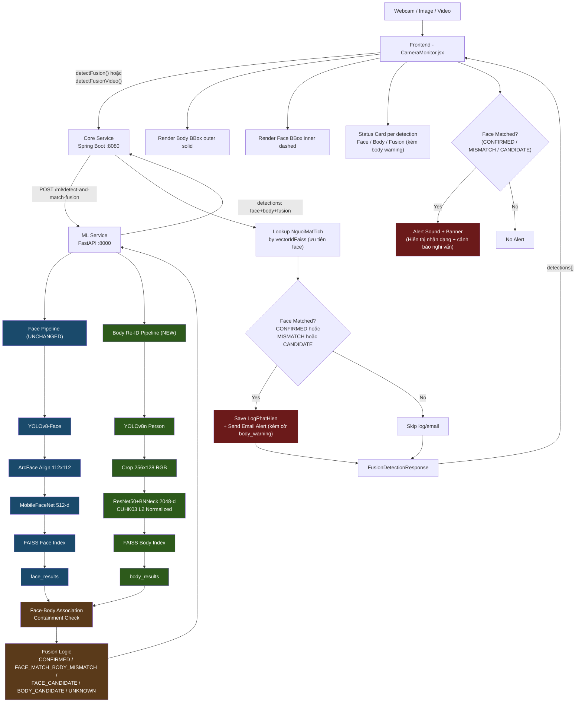

# Body Re-ID Integration Plan

> **Trạng thái:** Kế hoạch — chưa implement.  
> **Nguyên tắc bất biến:** Face Recognition hiện tại là baseline. Body Re-ID là extension. Không sửa bất kỳ API hay logic Face nào đang hoạt động.  
> **Audit dựa trên:** Source code thực tế tại `d:/Tech/Python/person_detection/`

---

## 1. Executive Summary

Hệ thống hiện tại là một hệ thống nhận diện người mất tích dựa hoàn toàn vào **Face Recognition** (YOLOv8-Face + MobileFaceNet + FAISS). Kế hoạch này mở rộng hệ thống bằng cách bổ sung pipeline **Body Person Re-ID** (YOLOv8n + ResNet-50 CUHK03 + FAISS độc lập) chạy **song song** với Face Recognition.

Hai pipeline độc lập nhau hoàn toàn. Một lớp **Fusion** mỏng được thêm vào để kết hợp kết quả và đưa ra trạng thái (`CONFIRMED`, `FACE_MATCH_BODY_MISMATCH`, `FACE_CANDIDATE`, `BODY_CANDIDATE`, `UNKNOWN`).

> **Nguyên tắc ưu tiên Face Recognition (Face-Priority & Body-Assist):**
> Body Re-ID chỉ đóng vai trò **bổ trợ và tăng khả năng phát hiện** (đặc biệt khi đối tượng quay lưng, cúi mặt). Khuôn mặt là đặc trưng sinh trắc học cá nhân tin cậy nhất nên **Face Recognition luôn được ưu tiên tuyệt đối**.
> Hệ thống **loại bỏ hoàn toàn cơ chế xung đột hủy nhận diện (CONFLICT -> null)**. Khi khuôn mặt khớp nhưng trang phục/dáng người khác biệt (Face = P1, Body = P2), hệ thống **vẫn nhận dạng chính xác theo Face (person_id = P1)** và kích hoạt thông báo nhận dạng, đồng thời đính kèm **thông báo nghi vấn về body** để người giám sát chú ý (nghi vấn đối tượng đã thay đổi trang phục hoặc đi cùng người khác).

**Không có API Face cũ nào bị thay đổi hay xóa.** Toàn bộ hệ thống cũ tiếp tục hoạt động như bình thường.

---

## 2. Current System Audit

### 2.1 Công nghệ đang sử dụng

| Layer | Công nghệ |
|---|---|
| ML Service | Python, FastAPI, Uvicorn |
| Core Service | Java 21, Spring Boot 3.4.3, Spring Security, Hibernate |
| Database | MySQL 8.0.43 |
| Frontend | React, Vite |
| Vector Store | FAISS (IndexFlatIP + IndexIDMap2) |
| Face Detector | YOLOv8-Face (`yolov8n-face.pt`) |
| Face Embedder | MobileFaceNet ONNX (`w600k_mbf.onnx`) — 512-d |
| HTTP Client | Spring `RestClient` (JDK HttpClient) |
| Frontend API | `fetch` + `XMLHttpRequest` (video progress tracking) |

### 2.2 Repository Structure

```
person_detection/
  core-service/                    <- Spring Boot Java
    src/main/java/com/example/coreservice/
      client/
        MlServiceClient.java       <- Gọi ML Service qua HTTP
      controller/
        DetectionController.java   <- POST /api/detection/match
        NguoiMatTichController.java
        AuthController.java
        LogPhatHienController.java
      dto/
        DetectionResponse.java     <- Response cho Image detection
        VideoDetectionResponse.java
        FaceDetectionDto.java      <- Per-face detection item
        MlMatchResponse.java       <- Map từ /ml/detect-and-match
        MlVideoMatchResponse.java
        MlVideoTimelineItem.java
        MlVideoPersonSummary.java
        VideoPersonSummaryDto.java
        VideoTimelineItemDto.java
        NguoiMatTichResponse.java
        NguoiMatTichRequest.java
        LoginRequest.java / LoginResponse.java / LogPhatHienResponse.java
      entity/
        NguoiMatTich.java          <- Table nguoi_mat_tich
        LogPhatHien.java           <- Table log_phat_hien
        NguoiDung.java / VaiTro.java
      service/
        DetectionService.java      <- Business logic detection
        NguoiMatTichService.java
        EmailService.java
        FileStorageService.java
        LogPhatHienService.java
        AuthService.java

  ml-service/                      <- FastAPI Python
    app/
      detection.py                 <- YOLOv8-Face detector
      alignment.py                 <- ArcFace 5-point alignment
      embedding.py                 <- MobileFaceNet ONNX 512-d
      vector_store.py              <- FAISS face (dim=512)
      main.py                      <- FastAPI app + endpoints
    weights/
      yolov8n-face.pt
      w600k_mbf.onnx
    data/
      faiss_index.bin              <- FAISS face index

  frontend/
    src/
      services/
        api.js                     <- Toàn bộ API calls
      components/
        CameraMonitor.jsx          <- Webcam + Image + Video UI
      (các component khác)
```

---

## 3. Existing Face Recognition Architecture

Dựa trên source code thực tế:

```
Webcam / Image / Video
        |
        v
[Frontend - CameraMonitor.jsx]
  - Webcam: captureAndDetect() -> processImageBlob()
  - Image: handleFileChange() -> processImageBlob()
  - Video: handleAnalyzeVideo() -> detectVideo()
        |
        v
[Frontend - api.js]
  - detectFace(blob, threshold)
      -> POST /api/detection/match?threshold=0.45
  - detectVideo(blob, threshold, frameInterval, onProgress)
      -> POST /api/detection/match-video?threshold=0.45&frameInterval=1.0
        |
        v
[Core Service - DetectionController.java]
  - POST /api/detection/match
  - POST /api/detection/match-video
        |
        v
[Core Service - DetectionService.java]
  - detectAndMatch(file, threshold)
      1. fileStorageService.storeFile(file) -> lưu ảnh
      2. mlServiceClient.detectAndMatch(file, threshold)
      3. lookup nguoiMatTichRepository.findByVectorIdFaiss()
      4. logPhatHienRepository.save()
      5. emailService.sendMissingPersonAlert()
  - detectAndMatchVideo(file, threshold, frameInterval)
      1. fileStorageService.storeFile(file) -> lưu video
      2. mlServiceClient.detectAndMatchVideo(file, threshold, interval)
      3. loop uniquePersons -> lookup DB -> save log -> send email
      4. loop timeline -> lookup DB -> save snapshot
        |
        v
[Core Service - MlServiceClient.java]
  - detectAndMatch()
      -> POST /ml/detect-and-match?threshold=xxx
  - detectAndMatchVideo()
      -> POST /ml/detect-and-match-video?threshold=xxx&frame_interval_seconds=xxx
  - registerFace()
      -> POST /ml/register-face
  - deleteFace()
      -> DELETE /ml/face/{vectorId}
        |
        v
[ML Service - main.py]
  - POST /ml/detect-and-match
      1. YOLOv8FaceDetector.detect_faces()
      2. align_face_5point() -> 112x112
      3. MobileFaceNetEmbedder.extract_embedding() -> 512-d
      4. FaissVectorStore.search() -> cosine similarity
      -> Response: {matched, vector_id, similarity, bbox, all_detections}

  - POST /ml/detect-and-match-video
      1. Đọc video bằng OpenCV VideoCapture
      2. Sample frame mỗi frame_interval_seconds
      3. Mỗi frame: detect faces -> align -> embed -> search FAISS
      4. Build timeline + unique_persons
      -> Response: {matched, timeline, unique_persons, ...}

  - POST /ml/register-face
      -> detect face -> align -> embed -> FAISS.add_vector(embedding, vector_id)
```

### 3.1 Response JSON hiện tại của `/ml/detect-and-match`

```json
{
  "matched": true,
  "vector_id": 2,
  "similarity": 0.91,
  "bbox": [100, 80, 300, 350],
  "total_faces_detected": 1,
  "all_detections": [
    {
      "bbox": [100, 80, 300, 350],
      "confidence": 0.92,
      "matched": true,
      "vector_id": 2,
      "similarity": 0.91
    }
  ]
}
```

### 3.2 Response JSON hiện tại của `/api/detection/match` (Core Service)

```json
{
  "matched": true,
  "similarity": 0.91,
  "bbox": [100, 80, 300, 350],
  "anhChupUrl": "/uploads/...",
  "logId": 12,
  "hoSo": {
    "id": 2,
    "hoTen": "Nguyen Van A",
    "anhDaiDienUrl": "/uploads/...",
    "vectorIdFaiss": 2,
    "ngayMatTich": "2024-01-15",
    "khuVuc": "Ha Noi",
    "lienHeNguoiThan": "email@example.com",
    "createdAt": "...",
    "updatedAt": "..."
  },
  "detections": [
    {
      "bbox": [100, 80, 300, 350],
      "matched": true,
      "similarity": 0.91,
      "hoSo": { ... }
    }
  ],
  "message": "PHAT HIEN TRUNG KHOP: Nguyen Van A (Do tin cay: 91.00%)"
}
```

### 3.3 Database Schema hiện tại

**Table `nguoi_mat_tich`:**
```sql
id             BIGINT PK AUTO_INCREMENT
ho_ten         VARCHAR NOT NULL
anh_dai_dien_url VARCHAR(500)
vector_id_faiss  BIGINT NOT NULL UNIQUE  <- Key tham chiếu FAISS face index
ngay_mat_tich  DATE
khu_vuc        VARCHAR
lien_he_nguoi_than VARCHAR NOT NULL
created_at     DATETIME
updated_at     DATETIME
```

**Table `log_phat_hien`:**
```sql
id             BIGINT PK AUTO_INCREMENT
nguoi_mat_tich_id BIGINT FK -> nguoi_mat_tich.id
thoi_gian      DATETIME NOT NULL
do_tin_cay     FLOAT NOT NULL
anh_chup_url   VARCHAR(500)
```

> **Quan sát quan trọng:** `vector_id_faiss` là field duy nhất nối entity người mất tích với FAISS face index. Không có field tương đương cho Body Re-ID.

---

## 4. Existing Webcam Flow

```
CameraMonitor.jsx
  |
  +-- useEffect: setInterval(captureAndDetect, scanInterval)
  |
  +-- captureAndDetect()
        |
        +-- canvas.toBlob() -> blob
        |
        +-- processImageBlob(blob, width, height)
              |
              +-- detectFusion(blob, threshold, threshold)  [sau khi tích hợp]
              |   hoặc detectFace(blob, threshold)           [hiện tại]
              |
              +-- setLastResult(result)
              +-- drawBoundingBox(result, ...)
              +-- if (result.matched && firstMatch) -> playAlertSound() + setAlertData()
```

**api.js - detectFace() hiện tại:**
```javascript
POST /api/detection/match?threshold=0.45
Content-Type: multipart/form-data
Body: file=<blob>
```

---

## 5. Existing Image Flow

```
CameraMonitor.jsx
  |
  +-- handleFileChange(e) -> setStaticImage(file)
  |
  +-- processImageBlob(blob, width, height, imgElement)
        |
        +-- detectFusion() hoặc detectFace()
        +-- setLastResult()
        +-- drawBoundingBox()
        +-- alert nếu matched
```

---

## 6. Existing Video Flow

```
CameraMonitor.jsx
  |
  +-- handleVideoSelect() -> loadVideoFile()
  |
  +-- handleAnalyzeVideo()
        |
        +-- detectVideo(videoFile, threshold, frameInterval, onProgress)
              |
              XMLHttpRequest
              POST /api/detection/match-video?threshold=...&frameInterval=...
              |
              +-- setVideoResult(result)
              +-- setVideoActiveTab('summary')
              +-- if matched -> playAlertSound() + setAlertData()
```

**Tracking upload progress:** `xhr.upload.onprogress` với 5 phút timeout.

---

## 7. Body Re-ID Model

### 7.1 File Model
```
best_cuhk03_model_rerank.pth
```

### 7.2 Architecture

```
Input (RGB, 256x128)
    |
    v
ResNet-50 Backbone
  Conv1 -> BN -> ReLU -> MaxPool
  Layer1 (3 blocks)
  Layer2 (4 blocks)
  Layer3 (6 blocks)
  Layer4 (3 blocks) <- stride=(1,1) ở block đầu (không phải mặc định (2,2))
    |
    v
Global Average Pooling (GAP) -> (B, 2048, 1, 1) -> flatten -> (B, 2048)
    |
    v
BNNeck (BatchNorm1d(2048))
    |
    v
Output: (B, 2048)  <- Lấy đây làm embedding khi Inference
    |
    v [chỉ khi Training]
Classifier (Linear(2048, num_classes))
```

**Sửa đổi stride tại Layer4:**
```python
# Trong ResNet-50 gốc, Layer4 block đầu có stride=2
# CUHK03 model sửa thành stride=1 để giữ feature map resolution cao hơn
backbone.layer4[0].conv2.stride = (1, 1)
backbone.layer4[0].downsample[0].stride = (1, 1)
```

### 7.3 Input Requirements

| Thuộc tính | Giá trị |
|---|---|
| Format | RGB (convert từ BGR của OpenCV) |
| Height x Width | **256 x 128** |
| Normalize mean | `[0.485, 0.456, 0.406]` |
| Normalize std | `[0.229, 0.224, 0.225]` |
| Tensor type | `torch.float32`, `[B, C, H, W]` |

### 7.4 Inference Pipeline

```python
model.eval()                           # BẮT BUỘC
with torch.no_grad():
    feat = model(tensor)               # (B, 2048)
feat = F.normalize(feat, p=2, dim=1)  # L2 Normalize - BẮT BUỘC
embedding = feat.squeeze(0).numpy()   # (2048,) numpy array
```

### 7.5 Similarity & Threshold

- **Distance metric:** Cosine Similarity (IndexFlatIP sau L2 normalize = cosine)
- **Threshold ban đầu:** `0.65 – 0.75`
- **Lưu ý:** Đây chỉ là giá trị khởi đầu từ spec CUHK03. Phải benchmark trên camera thực tế của hệ thống để chọn ngưỡng production phù hợp. CUHK03 train trong điều kiện controlled lab, camera giám sát thực tế thường có resolution thấp hơn và góc nhìn khó hơn.

---

## 8. Target Architecture

### 8.1 Full System Flow sau khi tích hợp

```
Webcam / Image / Video
        |
        v
[Frontend - CameraMonitor.jsx]
  Không thay đổi logic cũ
  Chỉ thêm: gọi detectFusion() thay vì detectFace()
  (hoặc giữ cả hai, chọn theo mode)
        |
        v
[Frontend - api.js]
  GIỮ NGUYÊN: detectFace(), detectVideo()
  THÊM MỚI: detectFusion(), detectFusionVideo()
        |
        v
[Core Service - DetectionController.java]
  GIỮ NGUYÊN: POST /api/detection/match
              POST /api/detection/match-video
  THÊM MỚI:  POST /api/detection/match/fusion
              POST /api/detection/match/fusion-video
        |
        v
[Core Service - DetectionService.java]
  GIỮ NGUYÊN: detectAndMatch(), detectAndMatchVideo()
  THÊM MỚI:  detectAndMatchFusion(), detectAndMatchFusionVideo()
        |
        v
[Core Service - MlServiceClient.java]
  GIỮ NGUYÊN: detectAndMatch(), detectAndMatchVideo()
  THÊM MỚI:  detectAndMatchFusion(), detectAndMatchFusionVideo()
             registerBody()
        |
        v
[ML Service - main.py]
  GIỮ NGUYÊN: /ml/detect-and-match
              /ml/detect-and-match-video
              /ml/register-face
              /ml/face/{vectorId}
              /ml/health
  THÊM MỚI:  /ml/detect-and-match-fusion
              /ml/detect-and-match-fusion-video
              /ml/register-body
        |
        +----------------+------------------+
        |                                   |
        v                                   v
[Face Pipeline]                      [Body Re-ID Pipeline]
YOLOv8-Face detect                   YOLOv8n person detect
ArcFace align (112x112)              Crop person (256x128)
MobileFaceNet embed (512-d)          ResNet50+BNNeck embed (2048-d)
FAISS face search                    FAISS body search
face_result                          body_result
        |                                   |
        +----------------+------------------+
                         |
                         v
                [Face-Body Association]
                containment check: face_bbox inside body_bbox
                -> pair each face with nearest body
                         |
                         v
                [Fusion Logic]
                face_matched + body_matched -> status
                         |
                         v
                [Combined Detections]
                Each detection: {bbox, face, body, fusion}
                         |
                         v
              [Core Service]
              lookup NguoiMatTich by vectorIdFaiss (ưu tiên face.person_id)
              -> attach hoSo to matched detections
              -> save log (khi Face match: CONFIRMED, FACE_MATCH_BODY_MISMATCH, FACE_CANDIDATE)
              -> send email & alert (khi CONFIRMED hoặc FACE_MATCH_BODY_MISMATCH kèm cảnh báo nghi vấn)
                         |
                         v
              [Frontend]
              render face bbox (inner, dashed)
              render body bbox (outer, solid)
              render fusion status badge
              render per-detection status card
```

### 8.2 Parallel Execution Strategy

```python
# Hai pipeline chạy song song trong ThreadPoolExecutor
import concurrent.futures

with concurrent.futures.ThreadPoolExecutor(max_workers=2) as executor:
    face_future = executor.submit(run_face_pipeline, image, face_threshold)
    body_future = executor.submit(run_body_pipeline, image, body_threshold)
    face_results = face_future.result()
    body_results = body_future.result()
```

---

## 9. Face/Body Independence Principle

### Nguyên tắc bất biến

| Quy tắc | Đúng | SAI |
|---|---|---|
| Similarity | `face.similarity` và `body.similarity` độc lập | `Math.max(face.sim, body.sim)` |
| Person ID | `face.person_id` và `body.person_id` độc lập | `person_id = face_id OR body_id` |
| BBox | face.bbox và body.bbox độc lập | Dùng body bbox cho face |
| Null | `face=null` = không detect được face | `face={matched:false, sim:0}` |
| Override | Không bao giờ ghi đè | `face.similarity = body.similarity` |
| Ưu tiên Face | Face khớp -> nhận dạng theo Face + cảnh báo nghi vấn Body | Coi là xung đột vô danh (`CONFLICT -> null`) |

### Data Structure bắt buộc (không được flatten)

```
Detection:
  detection_id: int
  bbox: [x1,y1,x2,y2]     <- body bbox (outer)

  face:                     <- null nếu không detect được face
    matched: bool
    person_id: int|null
    similarity: float
    bbox: [x1,y1,x2,y2]    <- face bbox (inner)

  body:                     <- null nếu không detect được body
    matched: bool
    person_id: int|null
    similarity: float
    bbox: [x1,y1,x2,y2]

  fusion:
    status: string         <- CONFIRMED | FACE_MATCH_BODY_MISMATCH | FACE_CANDIDATE | BODY_CANDIDATE | UNKNOWN
    person_id: int|null    <- Ưu tiên face.person_id khi face matched
    body_warning: bool     <- true khi có nghi vấn trang phục/dáng người không khớp
    message: string        <- Thông báo nhận diện và cảnh báo nghi vấn
```

---

## 10. Face-Body Association

### 10.1 Vấn đề

Sau khi chạy song song:
- Face pipeline trả về N face detections (mỗi face có bbox khuôn mặt)
- Body pipeline trả về M body detections (mỗi body có bbox toàn thân)
- Cần ghép: face nào thuộc body nào?

### 10.2 Lựa chọn phương án

**Phương án được chọn: Containment Check (Face Inside Body)**

```
Điều kiện: face_bbox nằm BÊN TRONG body_bbox
face_x1 >= body_x1 AND
face_y1 >= body_y1 AND
face_x2 <= body_x2 AND
face_y2 <= body_y2
```

**Lý do chọn:**
- Trong ảnh giám sát thực tế, face bbox luôn nhỏ hơn và nằm trong body bbox
- Đơn giản, không có false positive nếu bbox đủ chính xác
- Phù hợp với pipeline: YOLOv8-Face detect face area, YOLOv8n detect whole body

**Tiebreaker nếu nhiều body thỏa điều kiện:**
```python
# Chọn body có center gần face center nhất
dist = sqrt((face_cx - body_cx)^2 + (face_cy - body_cy)^2)
# Chọn body_idx có dist nhỏ nhất
```

**Edge cases:**
- Face không nằm trong body nào → `body = null` cho detection đó (face-only)
- Body không có face nào → `face = null` cho detection đó (body-only)

### 10.3 Pseudocode Association

```python
def associate_face_body(face_results, body_results):
    detections = []
    used_body_ids = set()

    for face in face_results:
        best_body = None
        best_dist = inf
        for i, body in enumerate(body_results):
            if i in used_body_ids: continue
            if face_inside_body(face.bbox, body.bbox):
                d = center_distance(face.bbox, body.bbox)
                if d < best_dist:
                    best_dist = d
                    best_body = (i, body)

        if best_body:
            used_body_ids.add(best_body[0])
            detections.append({
                bbox: best_body[1].bbox,   # outer = body
                face: face_info,
                body: body_info
            })
        else:
            detections.append({
                bbox: face.bbox,
                face: face_info,
                body: None
            })

    for i, body in enumerate(body_results):
        if i not in used_body_ids:
            detections.append({
                bbox: body.bbox,
                face: None,
                body: body_info
            })

    return detections
```

---

## 11. Fusion Logic

### 11.1 Nguyên tắc thiết kế Fusion (Face-Priority & Body-Assist)

1. **Face Recognition có quyền ưu tiên cao nhất:** Khuôn mặt là đặc trưng sinh trắc học cá nhân tin cậy nhất. Trang phục và dáng người có thể thay đổi trong ngày (thay áo, mặc áo khoác) hoặc bị trùng lặp giữa nhiều người. Do đó, Re-ID chỉ đóng vai trò **bổ trợ và tăng khả năng phát hiện**, tuyệt đối không được ghi đè hay phủ quyết kết quả của Face Recognition.
2. **Loại bỏ trạng thái CONFLICT (xung đột làm mất nhận dạng):**
   - Hệ thống **bỏ phần Xung đột (`CONFLICT -> null`)**. Khi Face nhận diện được người A (`person_id = 2`) nhưng Body nhận diện ra người B (`person_id = 5`), hệ thống **vẫn khẳng định đối tượng là người A theo Face Recognition**, vẫn trả về thông báo nhận dạng và hồ sơ người A.
   - Đồng thời, hệ thống phát sinh thêm **thông báo nghi vấn về Body** (`body_warning = true`, status: `FACE_MATCH_BODY_MISMATCH`) để cảnh báo người vận hành kiểm tra trực quan (nghi vấn đối tượng đã thay đổi trang phục hoặc đang đứng sát người khác).

### 11.2 Bảng trạng thái Fusion (Ưu tiên Face Recognition)

| Face | Body | Fusion Status | Person ID | Body Warning | Ý nghĩa & Hành động |
|---|---|---|---|---|---|
| matched P1 | matched P1 | **CONFIRMED** | **P1** | `false` | Khớp cả khuôn mặt và dáng người — Tin cậy cao nhất. Alert đỏ + lưu log + email. |
| matched P1 | matched P2 | **FACE_MATCH_BODY_MISMATCH** | **P1** *(ưu tiên Face)* | **`true`** | **Nhận dạng theo Face (P1)**, đính kèm cảnh báo nghi vấn body (khớp P2). Alert cam + thông báo nhận dạng + cảnh báo nghi vấn. |
| matched P1 | not matched | **FACE_CANDIDATE** | **P1** | `false` | Nhận dạng theo Face (body không khớp / đã thay đồ). Alert / thông báo nhận dạng P1. |
| matched P1 | null | **FACE_CANDIDATE** | **P1** | `false` | Nhận dạng theo Face (không detect được toàn thân). Alert / thông báo nhận dạng P1. |
| not matched | matched P1 | **BODY_CANDIDATE** | **P1** | `false` | Quay lưng/che mặt, chỉ khớp dáng người/trang phục. Gợi ý kiểm tra thủ công. |
| null | matched P1 | **BODY_CANDIDATE** | **P1** | `false` | Không thấy mặt, chỉ khớp dáng người. Gợi ý kiểm tra thủ công. |
| not matched | not matched | **UNKNOWN** | null | `false` | Không nhận diện được đối tượng nào. |
| null | null | **UNKNOWN** | null | `false` | Không phát hiện được đối tượng trong frame. |

### 11.3 Thuật toán Fusion

```python
def fuse_results(face_matched, face_person_id, body_matched, body_person_id):
    """
    Kết hợp kết quả giữa Face Recognition và Body Re-ID.
    NGUYÊN TẮC: Face Recognition được ưu tiên tuyệt đối. Re-ID chỉ bổ trợ.
    Không hủy nhận diện khi mâu thuẫn body, mà ưu tiên Face và đính kèm cảnh báo nghi vấn.
    """
    # 1. Trường hợp Face nhận diện thành công (ưu tiên tuyệt đối)
    if face_matched and face_person_id is not None:
        if body_matched and body_person_id is not None:
            if face_person_id == body_person_id:
                return {
                    "status": "CONFIRMED",
                    "person_id": face_person_id,
                    "body_warning": False,
                    "message": f"Xác nhận trùng khớp cả khuôn mặt và dáng người (Hồ sơ #{face_person_id})"
                }
            else:
                # Face khớp P1 nhưng Body khớp P2 -> Ưu tiên Face (P1), cảnh báo nghi vấn Body (P2)
                return {
                    "status": "FACE_MATCH_BODY_MISMATCH",
                    "person_id": face_person_id,
                    "body_warning": True,
                    "message": (
                        f"Nhận dạng thành công theo khuôn mặt (Hồ sơ #{face_person_id}). "
                        f"CẢNH BÁO NGHI VẤN: Dáng người/trang phục khớp với hồ sơ #{body_person_id} "
                        f"(nghi vấn đối tượng đã thay đổi trang phục hoặc đi cùng người khác)."
                    )
                }
        else:
            # Face khớp nhưng Body không khớp hoặc chưa đăng ký
            return {
                "status": "FACE_CANDIDATE",
                "person_id": face_person_id,
                "body_warning": False,
                "message": f"Nhận dạng theo khuôn mặt (Hồ sơ #{face_person_id}). Dáng người chưa được xác nhận."
            }

    # 2. Trường hợp không nhận diện được mặt (quay lưng/che mặt), chỉ nhận diện theo body
    elif body_matched and body_person_id is not None:
        return {
            "status": "BODY_CANDIDATE",
            "person_id": body_person_id,
            "body_warning": False,
            "message": f"Phát hiện nghi vấn qua dáng người/trang phục (Hồ sơ #{body_person_id}). Chưa xác nhận được khuôn mặt."
        }

    # 3. Không nhận diện được ai
    else:
        return {
            "status": "UNKNOWN",
            "person_id": None,
            "body_warning": False,
            "message": "Không nhận diện được đối tượng."
        }
```

### 11.4 Alert & Notification Policy

| Fusion Status | Alert | Hiển thị & Hành động |
|---|---|---|
| **CONFIRMED** | **Có (Đỏ)** | Alert âm thanh + Banner đỏ + Gửi email + Lưu log. Độ tin cậy tuyệt đối. |
| **FACE_MATCH_BODY_MISMATCH** | **Có (Cam/Vàng)** | Alert âm thanh + Banner cam "Phát hiện đối tượng [Tên] - ⚠️ CẢNH BÁO: Dáng người/trang phục không khớp" + Lưu log + Gửi email (kèm cờ nghi vấn body). |
| **FACE_CANDIDATE** | **Có (Xanh/Cam)** | Thông báo phát hiện theo khuôn mặt [Tên] + Lưu log (giữ nguyên tính năng của Face baseline cũ). |
| **BODY_CANDIDATE** | Thông báo gợi ý (Tím) | Gợi ý nghi vấn đối tượng theo dáng người, khuyến nghị người vận hành kiểm tra camera/ảnh trực tiếp. |
| **UNKNOWN** | Không | Người lạ / qua đường bình thường. |

> **Lưu ý:** Face Recognition là baseline của hệ thống cũ. Bất cứ khi nào Face nhận diện được đối tượng, hệ thống đều đảm bảo gửi thông báo nhận dạng và lưu hồ sơ, tuyệt đối không bị bỏ sót do Re-ID.

---

## 12. API Contract

### 12.1 API Face cũ — KHÔNG THAY ĐỔI

```
POST /api/detection/match
POST /api/detection/match-video
POST /api/nguoi-mat-tich (register)
DELETE /api/nguoi-mat-tich/{id}

ML Service:
POST /ml/detect-and-match
POST /ml/detect-and-match-video
POST /ml/register-face
DELETE /ml/face/{vectorId}
GET /ml/health
```

### 12.2 API Fusion mới

**Frontend → Core Service:**
```
POST /api/detection/match/fusion
  Request: multipart/form-data
    file: <image blob>
    faceThreshold: double (default 0.45)
    bodyThreshold: double (default 0.65)

POST /api/detection/match/fusion-video
  Request: multipart/form-data
    file: <video blob>
    faceThreshold: double (default 0.45)
    bodyThreshold: double (default 0.65)
    frameInterval: double (default 1.0)

POST /api/nguoi-mat-tich/{id}/register-body
  Request: multipart/form-data
    file: <image blob>
  Mục đích: Đăng ký body embedding cho hồ sơ đã có face
```

**Core Service → ML Service:**
```
POST /ml/detect-and-match-fusion?face_threshold=0.45&body_threshold=0.65
  Request: multipart/form-data
    file: <image blob>

POST /ml/detect-and-match-fusion-video?face_threshold=0.45&body_threshold=0.65&frame_interval_seconds=1.0
  Request: multipart/form-data
    file: <video blob>

POST /ml/register-body
  Request: multipart/form-data
    file: <image blob>
    vector_id: int  (phải trùng với vectorIdFaiss của NguoiMatTich)
```

### 12.3 Response Contract — Fusion Image

**ML Service response (`/ml/detect-and-match-fusion`):**
```json
{
  "matched": true,
  "total_persons": 2,
  "total_ms": 450,
  "detections": [
    {
      "detection_id": 0,
      "bbox": [10, 50, 400, 900],
      "face": {
        "matched": true,
        "person_id": 2,
        "similarity": 0.91,
        "bbox": [80, 60, 280, 320]
      },
      "body": {
        "matched": true,
        "person_id": 2,
        "similarity": 0.84,
        "bbox": [10, 50, 400, 900]
      },
      "fusion": {
        "status": "CONFIRMED",
        "person_id": 2,
        "body_warning": false,
        "message": "Xác nhận trùng khớp cả khuôn mặt và dáng người (Hồ sơ #2)"
      }
    },
    {
      "detection_id": 1,
      "bbox": [450, 30, 800, 920],
      "face": {
        "matched": true,
        "person_id": 2,
        "similarity": 0.88,
        "bbox": [500, 40, 680, 260]
      },
      "body": {
        "matched": true,
        "person_id": 5,
        "similarity": 0.78,
        "bbox": [450, 30, 800, 920]
      },
      "fusion": {
        "status": "FACE_MATCH_BODY_MISMATCH",
        "person_id": 2,
        "body_warning": true,
        "message": "Nhận dạng thành công theo khuôn mặt (Hồ sơ #2). CẢNH BÁO NGHI VẤN: Dáng người/trang phục khớp với hồ sơ #5 (nghi vấn đối tượng đã thay trang phục)."
      }
    },
    {
      "detection_id": 2,
      "bbox": [850, 100, 1100, 900],
      "face": null,
      "body": {
        "matched": false,
        "person_id": null,
        "similarity": 0.35,
        "bbox": [850, 100, 1100, 900]
      },
      "fusion": {
        "status": "UNKNOWN",
        "person_id": null,
        "body_warning": false,
        "message": "Không nhận diện được đối tượng."
      }
    }
  ]
}
```

**Core Service response (`/api/detection/match/fusion`):**
```json
{
  "matched": true,
  "anhChupUrl": "/uploads/capture_xxx.jpg",
  "message": "Phát hiện 2 trùng khớp (1 xác nhận đầy đủ, 1 cảnh báo nghi vấn trang phục).",
  "detections": [
    {
      "detectionId": 0,
      "bbox": [10, 50, 400, 900],
      "face": {
        "matched": true,
        "personId": 2,
        "similarity": 0.91,
        "bbox": [80, 60, 280, 320]
      },
      "body": {
        "matched": true,
        "personId": 2,
        "similarity": 0.84,
        "bbox": [10, 50, 400, 900]
      },
      "fusion": {
        "status": "CONFIRMED",
        "personId": 2,
        "bodyWarning": false,
        "message": "Xác nhận trùng khớp cả khuôn mặt và dáng người (Hồ sơ #2)"
      },
      "hoSo": {
        "id": 2,
        "hoTen": "Nguyen Van A",
        "anhDaiDienUrl": "/uploads/...",
        "vectorIdFaiss": 2,
        "ngayMatTich": "2024-01-15",
        "khuVuc": "Ha Noi",
        "lienHeNguoiThan": "email@example.com"
      }
    },
    {
      "detectionId": 1,
      "bbox": [450, 30, 800, 920],
      "face": {
        "matched": true,
        "personId": 2,
        "similarity": 0.88,
        "bbox": [500, 40, 680, 260]
      },
      "body": {
        "matched": true,
        "personId": 5,
        "similarity": 0.78,
        "bbox": [450, 30, 800, 920]
      },
      "fusion": {
        "status": "FACE_MATCH_BODY_MISMATCH",
        "personId": 2,
        "bodyWarning": true,
        "message": "Nhận dạng thành công theo khuôn mặt (Hồ sơ #2). CẢNH BÁO NGHI VẤN: Dáng người/trang phục khớp với hồ sơ #5."
      },
      "hoSo": {
        "id": 2,
        "hoTen": "Nguyen Van A",
        "anhDaiDienUrl": "/uploads/...",
        "vectorIdFaiss": 2,
        "ngayMatTich": "2024-01-15",
        "khuVuc": "Ha Noi",
        "lienHeNguoiThan": "email@example.com"
      }
    },
    {
      "detectionId": 2,
      "bbox": [850, 100, 1100, 900],
      "face": null,
      "body": {
        "matched": false,
        "personId": null,
        "similarity": 0.35,
        "bbox": [850, 100, 1100, 900]
      },
      "fusion": {
        "status": "UNKNOWN",
        "personId": null,
        "bodyWarning": false,
        "message": "Không nhận diện được đối tượng."
      },
      "hoSo": null
    }
  ]
}
```

### 12.4 Response Contract — Fusion Video Timeline

**ML Service response (`/ml/detect-and-match-fusion-video`):**
```json
{
  "matched": true,
  "total_frames": 900,
  "timeline": [
    {
      "timestamp": 5.0,
      "timestamp_formatted": "00:05",
      "frame_index": 125,
      "person_id": 2,
      "fusion_status": "CONFIRMED",
      "face_similarity": 0.91,
      "body_similarity": 0.84,
      "bbox": [10, 50, 400, 900]
    }
  ],
  "unique_persons": [
    {
      "person_id": 2,
      "fusion_status": "CONFIRMED",
      "max_face_similarity": 0.91,
      "max_body_similarity": 0.84,
      "occurrences": 3,
      "first_seen": "00:05",
      "last_seen": "01:20"
    }
  ]
}
```

> **Lưu ý quan trọng:** `face_similarity` và `body_similarity` phải được giữ **độc lập** trong timeline. Không được gộp thành `similarity = max(...)`.

---

## 13. ML Service Changes

### 13.1 Files KHÔNG được sửa

```
app/detection.py      <- DO NOT MODIFY
app/alignment.py      <- DO NOT MODIFY
app/embedding.py      <- DO NOT MODIFY
app/vector_store.py   <- DO NOT MODIFY
```

### 13.2 Files cần tạo mới

```
ml-service/app/reid/
  __init__.py
  model.py              <- ResNet50 + BNNeck loader
  body_detector.py      <- YOLOv8n person detector
  embedder.py           <- Body embedding extractor (2048-d)
  vector_store_body.py  <- FAISS body (dim=2048)
  service.py            <- Body Re-ID pipeline

ml-service/app/
  fusion.py             <- fuse_results() + _associate_face_body()
```

### 13.3 Files cần sửa (tối thiểu)

```
ml-service/app/main.py
  -> Thêm imports
  -> Thêm 3 endpoint: /ml/register-body, /ml/detect-and-match-fusion,
                      /ml/detect-and-match-fusion-video
  -> Thêm helper: _associate_face_body()
  -> KHÔNG sửa các endpoint cũ
```

```
ml-service/requirements.txt
  -> Thêm: torch>=2.0.0, torchvision>=0.15.0
```

### 13.4 Trạng thái Weights hiện tại

```
ml-service/weights/                          <- Trạng thái thực tế
  best_cuhk03_model_rerank.pth   ✓ ĐÃ CÓ   (100.6 MB — Body Re-ID CUHK03)
  w600k_mbf.onnx                 ✓ ĐÃ CÓ   (13.6 MB — Face MobileFaceNet)
  yolov8n-face.pt                ✓ ĐÃ CÓ   (6.4 MB  — Face Detection)
  yolov8n.pt                     ✗ CHƯA CÓ <- Cần tải thêm (Person Detection)
```

**Chỉ cần tải thêm `yolov8n.pt`:**
```python
# Ultralytics tự động tải khi dùng lần đầu:
from ultralytics import YOLO
YOLO('yolov8n.pt')  # <- tự tải về nếu chưa có

# Hoặc tải thủ công:
# wget https://github.com/ultralytics/assets/releases/download/v0.0.0/yolov8n.pt
# Đặt vào ml-service/weights/yolov8n.pt
```

**Không cần copy `best_cuhk03_model_rerank.pth`** — đã sẵn trong `weights/`.

### 13.5 Data file tự tạo

```
ml-service/data/
  body_reid_index.bin             <- Tự tạo khi khởi động, giống faiss_index.bin
```

### 13.6 Error Isolation trong ML Service

```python
@app.post("/ml/detect-and-match-fusion")
async def detect_and_match_fusion(...):
    face_results = []
    body_results = []

    # Face pipeline - bắt lỗi độc lập
    try:
        face_results = run_face_pipeline(image, face_threshold)
    except Exception as e:
        print(f"[Fusion] Face pipeline error: {e}")
        # Tiếp tục với face_results = []

    # Body pipeline - bắt lỗi độc lập
    try:
        body_results = run_body_reid(image, body_threshold)
    except Exception as e:
        print(f"[Fusion] Body pipeline error: {e}")
        # Tiếp tục với body_results = []

    # Nếu cả hai đều lỗi
    if not face_results and not body_results:
        return {"matched": False, "total_persons": 0, "detections": []}

    # Association + Fusion vẫn chạy với dữ liệu hiện có
    detections = _associate_face_body(face_results, body_results)
    ...
```

---

## 14. Backend Changes

### 14.1 Files KHÔNG được sửa

```
entity/NguoiMatTich.java      <- DO NOT MODIFY (no DB schema change needed)
entity/LogPhatHien.java       <- DO NOT MODIFY
entity/NguoiDung.java         <- DO NOT MODIFY
dto/DetectionResponse.java    <- DO NOT MODIFY
dto/VideoDetectionResponse.java  <- DO NOT MODIFY
dto/FaceDetectionDto.java     <- DO NOT MODIFY
dto/MlMatchResponse.java      <- DO NOT MODIFY
dto/MlVideoMatchResponse.java <- DO NOT MODIFY
dto/MlVideoTimelineItem.java  <- DO NOT MODIFY
dto/VideoTimelineItemDto.java <- DO NOT MODIFY
dto/VideoPersonSummaryDto.java<- DO NOT MODIFY
```

### 14.2 Files cần tạo mới (DTO)

```
dto/MlFusionComponentResult.java    <- Map face/body từ Python
dto/MlFusionResult.java             <- Map fusion status từ Python
dto/MlFusionDetectionItem.java      <- Map mỗi detection item từ Python
dto/MlFusionResponse.java           <- Map toàn bộ /ml/detect-and-match-fusion
dto/FusionComponentResultDto.java   <- Response cho Frontend (face/body)
dto/FusionStatusDto.java            <- Response cho Frontend (fusion)
dto/FusionDetectionItemDto.java     <- Response cho Frontend (mỗi detection)
dto/FusionDetectionResponse.java    <- Response cho Frontend (toàn bộ)
dto/MlFusionVideoTimelineItem.java  <- Map timeline từ Python
dto/MlFusionVideoResponse.java      <- Map video fusion response từ Python
dto/FusionVideoTimelineItemDto.java <- Response cho Frontend (video timeline)
dto/FusionVideoPersonSummaryDto.java<- Response cho Frontend (video summary)
dto/FusionVideoDetectionResponse.java <- Response cho Frontend (video)
```

### 14.3 Files cần sửa

**`MlServiceClient.java` — Thêm methods mới:**
```java
// THÊM method mới, KHÔNG sửa method cũ
MlFusionResponse detectAndMatchFusion(MultipartFile file, double faceThreshold, double bodyThreshold);
MlFusionVideoResponse detectAndMatchFusionVideo(MultipartFile file, double faceThreshold, double bodyThreshold, double frameInterval);
void registerBody(MultipartFile file, Long vectorId);
```

**`DetectionService.java` — Thêm methods mới:**
```java
// THÊM method mới, KHÔNG sửa method cũ
@Transactional
public FusionDetectionResponse detectAndMatchFusion(MultipartFile file, Double faceThreshold, Double bodyThreshold) {
    // 1. Lưu ảnh chụp
    // 2. Gọi mlServiceClient.detectAndMatchFusion()
    // 3. Với mỗi detection có fusion.personId != null:
    //    -> nguoiMatTichRepository.findByVectorIdFaiss(fusion.personId)
    //    -> gắn hoSo vào detection
    // 4. Lưu log & cảnh báo khi Face nhận dạng thành công (CONFIRMED, FACE_MATCH_BODY_MISMATCH, FACE_CANDIDATE)
    //    -> Đính kèm cờ bodyWarning nếu có nghi vấn về trang phục/dáng người
    // 5. Return FusionDetectionResponse
}
```

**`DetectionController.java` — Thêm endpoints mới:**
```java
// THÊM endpoint mới, KHÔNG sửa endpoint cũ
@PostMapping(value = "/match/fusion", consumes = MULTIPART_FORM_DATA_VALUE)
public ResponseEntity<FusionDetectionResponse> detectFusion(
    @RequestParam("file") MultipartFile file,
    @RequestParam(value = "faceThreshold", required = false, defaultValue = "0.45") Double faceThreshold,
    @RequestParam(value = "bodyThreshold", required = false, defaultValue = "0.65") Double bodyThreshold
);

@PostMapping(value = "/match/fusion-video", consumes = MULTIPART_FORM_DATA_VALUE)
public ResponseEntity<FusionVideoDetectionResponse> detectFusionVideo(
    @RequestParam("file") MultipartFile file,
    @RequestParam(value = "faceThreshold", required = false, defaultValue = "0.45") Double faceThreshold,
    @RequestParam(value = "bodyThreshold", required = false, defaultValue = "0.65") Double bodyThreshold,
    @RequestParam(value = "frameInterval", required = false, defaultValue = "1.0") Double frameInterval
);
```

**`NguoiMatTichController.java` — Thêm endpoint register body:**
```java
@PostMapping(value = "/{id}/register-body", consumes = MULTIPART_FORM_DATA_VALUE)
public ResponseEntity<?> registerBody(
    @PathVariable Long id,
    @RequestParam("file") MultipartFile file
);
```

**`NguoiMatTichService.java` — Thêm method register body:**
```java
public void registerBody(Long nguoiMatTichId, MultipartFile file) {
    NguoiMatTich nguoi = nguoiMatTichRepository.findById(nguoiMatTichId)
        .orElseThrow(() -> new RuntimeException("Không tìm thấy hồ sơ"));
    // Gọi mlServiceClient.registerBody(file, nguoi.getVectorIdFaiss())
    // vectorId của Body = vectorIdFaiss của Face (cùng người)
}
```

### 14.4 Về Database Schema — `log_phat_hien`

#### Phần không thay đổi

- `NguoiMatTich.vectorIdFaiss` giữ nguyên — là key chung cho cả Face FAISS và Body FAISS.
- Body FAISS dùng cùng `vectorIdFaiss` làm ID trong `body_reid_index.bin` → không cần thêm column mới vào `nguoi_mat_tich`.
- Lookup vẫn dùng: `nguoiMatTichRepository.findByVectorIdFaiss(fusion.personId)`.

#### Phần BẮT BUỘC phải cập nhật — `log_phat_hien`

**Vấn đề với schema hiện tại:**

```sql
do_tin_cay  FLOAT NOT NULL   <- Hiện chỉ lưu 1 giá trị similarity
```

Trường `do_tin_cay` hiện tại chỉ có một giá trị float. Với Face-only, điều này đủ vì chỉ có một nguồn. Sau khi tích hợp Fusion, hệ thống có **hai nguồn similarity hoàn toàn độc lập**:

- `face_similarity`: từ MobileFaceNet (512-d), scale cosine của face embedding
- `body_similarity`: từ ResNet50-CUHK03 (2048-d), scale cosine của body embedding

**Tại sao không được gộp hay dùng `max(face, body)`:**

> Face similarity 0.85 và Body similarity 0.85 là hai giá trị hoàn toàn không tương đương nhau.
> Face model được train trên dataset nhận diện khuôn mặt; Body model được train trên dataset Re-ID toàn thân.
> Threshold của chúng khác nhau (face ~0.45, body ~0.65-0.75).
> Một giá trị `max(0.85, 0.72)` không mang ý nghĩa gì cho người vận hành hệ thống.
> Khi xem lại log, không thể biết kết quả đến từ Face hay Body nếu chỉ có một số.

**Migration cần thực hiện:**

```sql
-- Thêm 4 column mới vào log_phat_hien
ALTER TABLE log_phat_hien
  ADD COLUMN face_similarity    FLOAT         NULL     COMMENT 'Cosine similarity từ MobileFaceNet (Face Recognition)',
  ADD COLUMN body_similarity    FLOAT         NULL     COMMENT 'Cosine similarity từ ResNet50-CUHK03 (Body Re-ID)',
  ADD COLUMN fusion_status      VARCHAR(30)   NULL     COMMENT 'CONFIRMED/FACE_MATCH_BODY_MISMATCH/FACE_CANDIDATE/BODY_CANDIDATE/UNKNOWN',
  ADD COLUMN body_warning       BOOLEAN       DEFAULT FALSE COMMENT 'true khi trang phục/dáng người không khớp với khuôn mặt';

-- do_tin_cay giữ nguyên để backward compat với Face-only API cũ
-- Với log từ Face-only API: do_tin_cay = face_similarity, face_similarity = face_similarity, body_similarity = NULL
-- Với log từ Fusion API:    do_tin_cay = face_similarity (nếu có) hoặc body_similarity (nếu face=null)
--                           face_similarity và body_similarity lưu riêng
```

**Cập nhật Entity `LogPhatHien.java`:**

```java
// Thêm các field mới vào LogPhatHien.java
@Column(name = "face_similarity")
private Float faceSimilarity;    // null nếu face không detect được

@Column(name = "body_similarity")
private Float bodySimilarity;    // null nếu body không match

@Column(name = "fusion_status", length = 30)
private String fusionStatus;     // CONFIRMED | FACE_MATCH_BODY_MISMATCH | FACE_CANDIDATE | BODY_CANDIDATE | UNKNOWN

@Column(name = "body_warning")
private Boolean bodyWarning = false; // true nếu có cảnh báo nghi vấn về trang phục/dáng người
// + getters/setters
```

**Logic lưu log trong `DetectionService.detectAndMatchFusion()`:**

```java
// ƯU TIÊN FACE: Lưu log khi nhận dạng thành công khuôn mặt (CONFIRMED, FACE_MATCH_BODY_MISMATCH, FACE_CANDIDATE)
String status = fusionItem.getFusion().getStatus();
boolean isFaceMatch = "CONFIRMED".equals(status) 
                   || "FACE_MATCH_BODY_MISMATCH".equals(status) 
                   || "FACE_CANDIDATE".equals(status);

if (isFaceMatch && nguoi != null) {
    LogPhatHien log = new LogPhatHien();
    log.setNguoiMatTich(nguoi);
    log.setThoiGian(LocalDateTime.now());

    // Lưu riêng từng nguồn similarity
    Float faceSim = fusionItem.getFace() != null ? fusionItem.getFace().getSimilarity() : null;
    Float bodySim = fusionItem.getBody() != null ? fusionItem.getBody().getSimilarity() : null;

    log.setFaceSimilarity(faceSim);    // null nếu face không detect được
    log.setBodySimilarity(bodySim);    // null nếu body không match
    log.setFusionStatus(status);
    log.setBodyWarning(Boolean.TRUE.equals(fusionItem.getFusion().getBodyWarning()));

    // do_tin_cay (backward compat): ưu tiên face, fallback body
    log.setDoTinCay(faceSim != null ? faceSim : (bodySim != null ? bodySim : 0f));
    log.setAnhChupUrl(capturedImageUrl);
    logPhatHienRepository.save(log);

    // Kích hoạt Alert email khi CONFIRMED hoặc FACE_MATCH_BODY_MISMATCH (đính kèm cảnh báo nghi vấn)
    if ("CONFIRMED".equals(status) || "FACE_MATCH_BODY_MISMATCH".equals(status)) {
        emailService.sendMissingPersonAlert(
            nguoi.getLienHeNguoiThan(),
            nguoi.getHoTen(),
            faceSim != null ? faceSim : 0f,
            log.getThoiGian(),
            capturedImageUrl
        );
    }
}
```

**Cập nhật `LogPhatHienResponse.java`:**

```java
// Thêm vào DTO response cho màn hình lịch sử phát hiện
private Float faceSimilarity;
private Float bodySimilarity;
private String fusionStatus;
```

**Tại sao `do_tin_cay` vẫn giữ:**
- Face-only API cũ (`/api/detection/match`) vẫn dùng `do_tin_cay` — backward compat
- Một số component Frontend đang đọc `doTinCay` để hiển thị % — không muốn phá vỡ
- Giá trị mới nhất có thể hiển thị `faceSimilarity` riêng và `bodySimilarity` riêng trong log detail view

**Tóm tắt yêu cầu migration:**

| Column | Hiện tại | Sau migration |
|---|---|---|
| `do_tin_cay` | FLOAT NOT NULL | Giữ nguyên (backward compat) |
| `face_similarity` | Không có | Thêm mới: FLOAT NULL |
| `body_similarity` | Không có | Thêm mới: FLOAT NULL |
| `fusion_status` | Không có | Thêm mới: VARCHAR(20) NULL |

> **Đây là thay đổi schema DUY NHẤT cần thiết trong toàn bộ kế hoạch tích hợp.**
> Tất cả thay đổi khác đều là additive (thêm file/endpoint mới) không đụng đến schema.

---

## 15. Frontend Changes

### 15.1 Files KHÔNG được sửa

```
src/components/ (tất cả component khác ngoài CameraMonitor.jsx)
src/pages/ (tất cả)
```

### 15.2 `api.js` — Thêm functions mới

```javascript
// GIỮ NGUYÊN: detectFace(), detectVideo(), tất cả functions cũ

// THÊM MỚI:
export async function detectFusion(fileBlob, faceThreshold = 0.45, bodyThreshold = 0.65) {
  const formData = new FormData();
  formData.append('file', fileBlob, 'frame.jpg');
  const response = await fetch(
    `${API_BASE_URL}/detection/match/fusion?faceThreshold=${faceThreshold}&bodyThreshold=${bodyThreshold}`,
    { method: 'POST', body: formData }
  );
  const data = await response.json();
  if (!response.ok) throw new Error(data.message || 'Lỗi nhận diện fusion');
  return data;
}

export function detectFusionVideo(fileBlob, faceThreshold = 0.45, bodyThreshold = 0.65, frameInterval = 1.0, onProgress = null) {
  // Tương tự detectVideo() nhưng gọi /detection/match/fusion-video
  // Giữ XMLHttpRequest để track upload progress
}
```

### 15.3 `CameraMonitor.jsx` — Thay đổi tối thiểu

**Nguyên tắc:** Không rewrite component. Chỉ sửa những điểm cần thiết.

**Import thêm:**
```javascript
import { detectFace, detectVideo, detectFusion, detectFusionVideo, getFullImageUrl } from '../services/api';
```

**Webcam scan — sửa processImageBlob():**
```javascript
// Trước: const result = await detectFace(blob, threshold);
// Sau:
const result = await detectFusion(blob, threshold, bodyThreshold);
```

**Image scan — tương tự processImageBlob().**

**Video analyze — sửa handleAnalyzeVideo():**
```javascript
// Trước: const result = await detectVideo(videoFile, threshold, frameInterval, onProgress);
// Sau:
const result = await detectFusionVideo(videoFile, threshold, bodyThreshold, frameInterval, onProgress);
```

**Alert logic — sửa từ `result.hoSo` sang `firstMatch.hoSo` (Ưu tiên Face Recognition):**
```javascript
const firstMatch = result.detections?.find(
  d => (d.fusion?.status === 'CONFIRMED' || d.fusion?.status === 'FACE_MATCH_BODY_MISMATCH' || d.fusion?.status === 'FACE_CANDIDATE') && d.hoSo
);
if (result.matched && firstMatch) {
  playAlertSound();
  setAlertData({
    matched: true,
    status: firstMatch.fusion?.status,
    bodyWarning: firstMatch.fusion?.bodyWarning || false,
    message: firstMatch.fusion?.message || '',
    faceSimilarity: firstMatch.face?.similarity || 0,
    bodySimilarity: firstMatch.body?.similarity || 0,
    hoSo: firstMatch.hoSo,
    anhChupUrl: result.anhChupUrl
  });
}
```

### 15.4 BBox Rendering — Hai bbox độc lập

```javascript
function drawFusionDetections(ctx, detections, scaleX, scaleY) {
  detections.forEach(det => {
    const status = det.fusion?.status || 'UNKNOWN';
    const color = statusToBodyColor(status);

    // Body BBox (OUTER) — viền đặc
    if (det.body?.bbox) {
      const [bx1, by1, bx2, by2] = det.body.bbox;
      ctx.strokeStyle = color;
      ctx.lineWidth = 2.5;
      ctx.setLineDash([]);
      ctx.strokeRect(bx1 * scaleX, by1 * scaleY,
                     (bx2-bx1)*scaleX, (by2-by1)*scaleY);
      // Label body similarity
      const bodyLabel = det.body.matched
        ? `Body P${det.body.personId}: ${(det.body.similarity*100).toFixed(0)}%`
        : `Body: ${(det.body.similarity*100).toFixed(0)}%`;
      ctx.fillStyle = color;
      ctx.fillText(bodyLabel, bx1*scaleX, by2*scaleY + 14);
    }

    // Face BBox (INNER) — viền đứt nét, màu xanh
    if (det.face?.bbox) {
      const [fx1, fy1, fx2, fy2] = det.face.bbox;
      ctx.strokeStyle = '#60a5fa';
      ctx.lineWidth = 1.5;
      ctx.setLineDash([4, 3]);
      ctx.strokeRect(fx1*scaleX, fy1*scaleY,
                     (fx2-fx1)*scaleX, (fy2-fy1)*scaleY);
      ctx.setLineDash([]);
      // Label face similarity
      const faceLabel = det.face.matched
        ? `Face P${det.face.personId}: ${(det.face.similarity*100).toFixed(0)}%`
        : `Face: ${(det.face.similarity*100).toFixed(0)}%`;
      ctx.fillStyle = '#60a5fa';
      ctx.fillText(faceLabel, fx1*scaleX, fy1*scaleY - 4);
    }
  });
}
```

### 15.5 Status Card — Phân biệt null vs 0

```jsx
// Khuôn mặt
{det.face == null ? (
  <span>✗ Không phát hiện khuôn mặt</span>          // null = không detect
) : det.face.matched ? (
  <span>✓ Khớp — P#{det.face.personId} — {(det.face.similarity*100).toFixed(1)}%</span>
) : (
  <span>✗ Đã phân tích — {(det.face.similarity*100).toFixed(1)}%</span>  // detect nhưng không khớp
)}

// Thân hình
{det.body == null ? (
  <span>✗ Không phát hiện thân hình</span>
) : det.body.matched ? (
  <span>✓ Khớp — P#{det.body.personId} — {(det.body.similarity*100).toFixed(1)}%</span>
) : (
  <span>✗ Đã phân tích — {(det.body.similarity*100).toFixed(1)}%</span>
)}

// Fusion
<FusionBadge status={det.fusion?.status} />
{det.fusion?.bodyWarning && (
  <div className="alert-warning-text">⚠️ {det.fusion.message}</div>
)}
{det.hoSo && <div>Hồ sơ: {det.hoSo.hoTen}</div>}
```

---

## 16. Webcam Integration

**Flow sau khi tích hợp:**
```
1. CameraMonitor bật webcam (giữ nguyên)
2. setInterval -> captureAndDetect() (giữ nguyên)
3. canvas.toBlob() -> blob (giữ nguyên)
4. processImageBlob(blob)
     -> detectFusion(blob, faceThreshold, bodyThreshold)  [ĐÃ SỬA]
     -> setLastResult(result)
     -> drawFusionDetections(ctx, result.detections, ...)  [ĐÃ SỬA]
     -> alert check qua firstMatch  [ĐÃ SỬA]
```

**Không thay đổi:**
- Interval timing
- Camera start/stop
- Canvas overlay mechanics
- Alert sound
- Alert banner UI

---

## 17. Image Integration

**Flow sau khi tích hợp:**
```
1. User upload ảnh (giữ nguyên)
2. handleFileChange -> setStaticImage (giữ nguyên)
3. processImageBlob(blob, width, height, imgElement)
     -> detectFusion()  [ĐÃ SỬA]
     -> drawFusionDetections()  [ĐÃ SỬA]
```

---

## 18. Video Integration

**Flow sau khi tích hợp:**
```
1. User upload video (giữ nguyên)
2. handleVideoSelect -> loadVideoFile (giữ nguyên)
3. handleAnalyzeVideo()
     -> detectFusionVideo()  [ĐÃ SỬA]
     -> setVideoResult(result)
     -> alert check qua uniquePersons (status=CONFIRMED)  [ĐÃ SỬA]
```

**Video Timeline:**
- `VideoTimelineItemDto` sẽ được mở rộng thêm `faceSimilarity`, `bodySimilarity`, `fusionStatus`
- **KHÔNG** xóa `similarity` cũ để backward compat với Frontend logic khác

**Render timeline:**
```jsx
{timeline.map(event => (
  <div key={event.timestamp}>
    <span>{event.timestampFormatted}</span>
    <span>Face: {(event.faceSimilarity*100).toFixed(0)}%</span>
    <span>Body: {(event.bodySimilarity*100).toFixed(0)}%</span>
    <FusionBadge status={event.fusionStatus} />
  </div>
))}
```

---

## 19. Error Isolation

### 19.1 ML Service Level

```python
# Mỗi pipeline bọc trong try/except riêng
# Nếu Body Re-ID lỗi -> body_results = [] -> Face vẫn trả kết quả
# Nếu Face lỗi -> face_results = [] -> Body vẫn trả kết quả
# Chỉ khi cả hai lỗi -> trả response rỗng, không raise HTTP 500
```

### 19.2 Core Service Level

```java
try {
    mlResult = mlServiceClient.detectAndMatchFusion(file, faceThreshold, bodyThreshold);
} catch (MlServiceException e) {
    // Fallback: thử gọi API Face cũ nếu Fusion endpoint lỗi
    // Hoặc trả response rỗng với message
}
```

### 19.3 Model Loading Level

```python
# Body model load failure -> service khởi động vẫn được
# body_vector_store sẽ trả matched=False cho mọi query
# Face vẫn hoạt động bình thường
try:
    _reid_model = load_cuhk03_model()
except Exception as e:
    print(f"[WARNING] Body ReID model load failed: {e}. Body pipeline disabled.")
    _reid_model = None
```

---

## 20. Performance

### 20.1 Baseline Latency (ước tính)

| Component | CPU ước tính | GPU ước tính |
|---|---|---|
| YOLOv8-Face detect | ~80ms | ~15ms |
| ArcFace align | ~5ms | - |
| MobileFaceNet embed | ~30ms | ~5ms |
| FAISS face search | ~1ms | - |
| **Face total** | **~116ms** | |
| YOLOv8n person detect | ~70ms | ~12ms |
| ResNet50 embed (2048) | ~150ms | ~20ms |
| FAISS body search | ~2ms | - |
| **Body total** | **~222ms** | |
| **Parallel total** | **~222ms** (bottleneck = body) | |
| Association + Fusion | ~1ms | - |
| **Grand total** | **~225ms/frame** | |

> Số liệu trên là ước tính. Phải benchmark trên phần cứng thực tế.

### 20.2 Optimization Strategy

**Webcam:**
- Giữ nguyên frame interval (hiện tại có `lastLiveScanTimeRef > 1000ms` throttling)
- Không xử lý frame mới khi `liveScanInProgressRef.current = true`
- Kết quả OK vì hai pipeline song song không tăng total latency đáng kể

**Video:**
- Giữ nguyên `frame_interval_seconds` (default 1.0s)
- Hai pipeline song song trong `ThreadPoolExecutor(max_workers=2)`

**Body Model:**
- Load một lần khi startup (singleton pattern)
- `torch.no_grad()` khi inference
- CPU: `map_location='cpu'`

**Chưa cần ngay (benchmark trước):**
- Batching multiple bodies cùng lúc
- Caching embeddings
- GPU deployment

---

## 21. Testing Strategy

### Test 1 — Face Regression

```
Input: Ảnh/Webcam gửi vào POST /api/detection/match (cũ)
Expected: Response giống hệt trước khi tích hợp Body Re-ID
Verify: {matched, similarity, bbox, hoSo, detections} không thay đổi
```

### Test 2 — Body Re-ID Standalone

```
Input: Ảnh toàn thân gửi vào POST /ml/detect-and-match-person (nếu có endpoint test)
Expected: {detection_id, bbox, similarity, matched}
Verify: embedding 2048-d, FAISS search hoạt động
```

### Test 3 — Multi-person Frame

```
Input: Ảnh có 3-4 người
Expected: detections[] có 3-4 phần tử, mỗi người độc lập
Verify: detection_id khác nhau, bbox khác nhau
```

### Test 4 — FACE_CANDIDATE

```
Input: Người đã đăng ký, body không đăng ký hoặc similarity < threshold
Expected: fusion.status = "FACE_CANDIDATE"
Verify: face.matched=true, body.matched=false, hoSo=null hoặc có
```

### Test 5 — BODY_CANDIDATE

```
Input: Người quay lưng / mặt bị che, body đã đăng ký
Expected: fusion.status = "BODY_CANDIDATE"
Verify: face=null hoặc face.matched=false, body.matched=true
```

### Test 6 — CONFIRMED

```
Input: Người đã đăng ký cả face và body, đứng trước camera
Expected: fusion.status = "CONFIRMED"
Verify: face.person_id == body.person_id == fusion.person_id
```

### Test 7 — FACE_MATCH_BODY_MISMATCH (Ưu tiên Face, cảnh báo nghi vấn Body)

```
Input: Ghép ảnh mặt người A (P1) với body người B (P2)
Expected:
  - fusion.status = "FACE_MATCH_BODY_MISMATCH"
  - fusion.person_id = P1 (Ưu tiên Face Recognition, KHÔNG đưa về null)
  - fusion.body_warning = true
  - hoSo: Trả về hồ sơ của Người A (P1)
  - Alert: Kích hoạt thông báo nhận dạng Người A kèm dòng cảnh báo nghi vấn dáng người/trang phục
Verify:
  - Face Recognition không bị phủ quyết hay hủy bỏ bởi Re-ID
  - Người vận hành nhận được thông tin nhận dạng chính xác và cờ cảnh báo nghi vấn trang phục
```

### Test 8 — UNKNOWN

```
Input: Người không đăng ký
Expected: fusion.status = "UNKNOWN"
Verify: face.matched=false, body.matched=false, hoSo=null, không alert
```

### Test 9 — Webcam Realtime

```
- Bật webcam
- Đưa người đã đăng ký vào frame
- Verify: Alert xuất hiện khi CONFIRMED, FACE_MATCH_BODY_MISMATCH (kèm cảnh báo nghi vấn) và FACE_CANDIDATE
- Xoay lưng: BODY_CANDIDATE (gợi ý kiểm tra dáng người nếu body đã đăng ký)
- Người lạ: UNKNOWN
```

### Test 10 — Image Multi-person

```
Input: Ảnh nhiều người, trong đó có 1 người đã đăng ký
Expected: detections[] độc lập, chỉ detection của người đã đăng ký có hoSo
```

### Test 11 — Video Timeline

```
Input: Video có người đã đăng ký xuất hiện nhiều frame
Expected: timeline[] có nhiều entries
Verify: faceSimilarity và bodySimilarity độc lập, không bị gộp
```

### Test 12 — Body Re-ID Failure Isolation

```
- Xóa body_reid_index.bin hoặc corrupt model
- Gửi ảnh vào /api/detection/match/fusion
Expected: Response vẫn trả về, face pipeline hoạt động
         body = null hoặc body.matched = false
         Không throw HTTP 500
```

### Test 13 — Face Pipeline Failure Isolation

```
- Simulate face detection error (test environment)
Expected: body_results vẫn trả về
          fusion.status có thể là BODY_CANDIDATE
```

### Test 14 — Frontend Regression

```
- Gọi /api/detection/match (cũ) từ Frontend
Expected: UI hiển thị như trước, không có crash
- Upload image mode: vẫn hoạt động
- Upload video mode: vẫn hoạt động
- Webcam mode: vẫn hoạt động
```

---

## 22. Phase-by-Phase Implementation

### PHASE 0 — Repository Audit & Freeze Baseline
```
Goal: Đảm bảo Face baseline hoạt động 100% trước khi thêm bất cứ thứ gì
Files to inspect: Tất cả
Files to modify: NONE
Implementation:
  - Chạy tất cả API Face cũ, record response
  - Chụp screenshots Webcam/Image/Video
  - Lưu expected outputs làm baseline
Expected behavior: Hệ thống Face hoạt động bình thường
Tests: Test 1, Test 14
Acceptance criteria: Tất cả Face API trả đúng kết quả
Rollback: N/A
```

### PHASE 1 — Body Re-ID ML Modules
```
Goal: Tạo Body Re-ID pipeline độc lập trong ML Service
Files to inspect: app/main.py, weights/, data/
Files to modify: requirements.txt (thêm torch), app/reid/__init__.py (tạo mới)
Files NOT to modify: app/detection.py, app/alignment.py, app/embedding.py, app/vector_store.py
Implementation:
  - Tạo app/reid/model.py (ResNet50 + BNNeck loader)
  - Tạo app/reid/body_detector.py (YOLOv8n)
  - Tạo app/reid/embedder.py (extract 2048-d)
  - Tạo app/reid/vector_store_body.py (FAISS body dim=2048)
  - Tạo app/reid/service.py (run_body_reid pipeline)
  - Cài: pip install torch torchvision
  - Tải yolov8n.pt vào weights/ (best_cuhk03_model_rerank.pth đã có sẵn)
Expected behavior: run_body_reid(image) trả về list detections
Tests: Test 2, Test 12
Acceptance criteria: Body FAISS tạo được, embedding 2048-d đúng L2 norm
Rollback: Xóa thư mục app/reid/ và rollback requirements.txt
```

### PHASE 2 — Fusion Logic & Association
```
Goal: Tạo fusion.py với fuse_results() và _associate_face_body()
Files to inspect: app/reid/service.py
Files to modify: NONE (tạo file mới)
Files NOT to modify: Tất cả file cũ
Implementation:
  - Tạo app/fusion.py
  - Test unit: fuse_results() với tất cả combinations
  - Test unit: _associate_face_body() với nhiều faces/bodies
Expected behavior: Fusion status đúng theo bảng logic
Tests: Test 4-8
Acceptance criteria: Tất cả 8 fusion cases đúng
Rollback: Xóa app/fusion.py
```

### PHASE 3 — ML Service Fusion Endpoints
```
Goal: Thêm 3 endpoint mới vào app/main.py
Files to inspect: app/main.py
Files to modify: app/main.py (thêm, không sửa code cũ)
Files NOT to modify: Tất cả code cũ trong main.py
Implementation:
  - Thêm imports cho reid và fusion
  - Thêm helper _associate_face_body() vào main.py (hoặc import từ fusion.py)
  - Thêm POST /ml/register-body
  - Thêm POST /ml/detect-and-match-fusion (song song + association + fusion)
  - Thêm POST /ml/detect-and-match-fusion-video
Expected behavior: Endpoint trả đúng response contract
Tests: Test 3, Test 6, Test 11, Test 12
Acceptance criteria: Response JSON đúng contract, Face API cũ không thay đổi
Rollback: Revert thêm trong main.py
```

### PHASE 4 — Body Registration Flow
```
Goal: Cho phép đăng ký body cho người đã có hồ sơ face
Files to inspect: NguoiMatTichService.java, NguoiMatTichController.java
Files to modify: MlServiceClient.java (thêm), NguoiMatTichService.java (thêm),
                 NguoiMatTichController.java (thêm)
Files NOT to modify: Entity, DTO cũ
Implementation:
  - Thêm registerBody() vào MlServiceClient.java
  - Thêm registerBody(id, file) vào NguoiMatTichService.java
  - Thêm POST /api/nguoi-mat-tich/{id}/register-body
  - vectorId = nguoi.getVectorIdFaiss() (dùng chung ID với face)
Expected behavior: Body embedding được lưu vào body_reid_index.bin với cùng vectorIdFaiss
Tests: Thủ công: đăng ký body rồi test detection
Acceptance criteria: body_reid_index.bin có data sau khi register
Rollback: Remove endpoint mới trong Controller/Service
```

### PHASE 5 — Backend Fusion DTO & Mapping
```
Goal: Tạo DTO mới và service logic cho Fusion
Files to inspect: DetectionService.java, MlServiceClient.java, dto/
Files to modify: MlServiceClient.java (thêm 2 methods),
                 DetectionService.java (thêm 2 methods),
                 DetectionController.java (thêm 2 endpoints)
Files NOT to modify: Tất cả DTO cũ, Entity, Database
Implementation:
  - Tạo 13 DTO mới (ML response + Frontend response)
  - Thêm detectAndMatchFusion() và detectAndMatchFusionVideo() vào MlServiceClient
  - Thêm detectAndMatchFusion() và detectAndMatchFusionVideo() vào DetectionService
  - Trong service: lookup hoSo (ưu tiên Face), lưu log khi Face nhận dạng thành công (CONFIRMED, FACE_MATCH_BODY_MISMATCH, FACE_CANDIDATE), gửi email cảnh báo khi CONFIRMED hoặc FACE_MATCH_BODY_MISMATCH (đính kèm cảnh báo nghi vấn body)
  - Thêm 2 endpoint vào DetectionController
Expected behavior: /api/detection/match/fusion trả đúng response contract
Tests: Test 3, Test 6, Test 10
Acceptance criteria: Core Service response có face/body/fusion/hoSo đúng
Rollback: Xóa DTO mới, remove endpoint mới trong Controller/Service
```

### PHASE 6 — Frontend API & Rendering
```
Goal: Thêm detectFusion/detectFusionVideo vào api.js, sửa CameraMonitor.jsx
Files to inspect: api.js, CameraMonitor.jsx
Files to modify: api.js (thêm functions), CameraMonitor.jsx (sửa tối thiểu)
Files NOT to modify: api.js functions cũ, component khác
Implementation:
  - Thêm detectFusion() vào api.js
  - Thêm detectFusionVideo() vào api.js
  - Sửa processImageBlob(): detectFace -> detectFusion
  - Sửa handleAnalyzeVideo(): detectVideo -> detectFusionVideo
  - Sửa alert logic: result.hoSo -> firstMatch.hoSo
  - Thêm drawFusionDetections() hoặc cập nhật drawBoundingBox()
  - Sửa Status Card render: null check, per-face/body/fusion display
Expected behavior: UI hiển thị đúng Face, Body, Fusion độc lập
Tests: Test 9, Test 10, Test 11, Test 14
Acceptance criteria: Webcam realtime hoạt động, hai BBox phân biệt
Rollback: Revert thay đổi trong CameraMonitor.jsx và api.js
```

### PHASE 7 — E2E Testing
```
Goal: Test toàn bộ flow từ Frontend đến ML Service
Files to inspect: Tất cả
Files to modify: NONE (chỉ test)
Implementation:
  - Chạy tất cả 14 test cases
  - So sánh kết quả với baseline Phase 0
  - Đo latency thực tế
  - Kiểm tra error isolation
Expected behavior: Tất cả test PASS
Tests: Test 1-14
Acceptance criteria: Face regression PASS, Fusion logic PASS
Rollback: Rollback từng Phase theo thứ tự ngược lại
```

### PHASE 8 — Performance Benchmark
```
Goal: Đo latency thực tế và quyết định optimization
Files to inspect: ML Service logs, Network tab
Files to modify: NONE (chỉ quan sát)
Implementation:
  - Đo time cho mỗi component
  - Đo total latency cho Webcam
  - So sánh với Face-only baseline
Expected behavior: Tổng latency < 500ms cho Webcam (hoặc acceptable)
```

---

## 23. File Impact Matrix

| File | Layer | Read | Modify | Lý do | Risk |
|---|---|---|---|---|---|
| `app/detection.py` | ML | ✓ | **DO NOT MODIFY** | Face detector, không cần thay đổi | - |
| `app/alignment.py` | ML | ✓ | **DO NOT MODIFY** | ArcFace align, không cần thay đổi | - |
| `app/embedding.py` | ML | ✓ | **DO NOT MODIFY** | MobileFaceNet, không cần thay đổi | - |
| `app/vector_store.py` | ML | ✓ | **DO NOT MODIFY** | FAISS face, không cần thay đổi | - |
| `app/main.py` | ML | ✓ | **THÊM** endpoints mới | Cần thêm 3 endpoint fusion | Thấp: chỉ thêm, không sửa |
| `requirements.txt` | ML | ✓ | **THÊM** torch | Cần PyTorch cho ResNet50 | Thấp: chỉ thêm dependency |
| `app/reid/` | ML | - | **TẠO MỚI** | Toàn bộ Body Re-ID pipeline | Không ảnh hưởng code cũ |
| `app/fusion.py` | ML | - | **TẠO MỚI** | Fusion logic | Không ảnh hưởng code cũ |
| `DetectionController.java` | Core | ✓ | **THÊM** endpoints | Cần thêm 2 endpoint fusion | Thấp: chỉ thêm |
| `DetectionService.java` | Core | ✓ | **THÊM** methods | Cần thêm 2 method fusion | Thấp: chỉ thêm |
| `MlServiceClient.java` | Core | ✓ | **THÊM** methods | Cần gọi /ml/...-fusion | Thấp: chỉ thêm |
| `NguoiMatTichController.java` | Core | ✓ | **THÊM** 1 endpoint | Register body | Thấp |
| `NguoiMatTichService.java` | Core | ✓ | **THÊM** 1 method | Register body | Thấp |
| `dto/DetectionResponse.java` | Core | ✓ | **DO NOT MODIFY** | Response Face cũ | - |
| `dto/VideoDetectionResponse.java` | Core | ✓ | **DO NOT MODIFY** | Response Video cũ | - |
| `dto/MlMatchResponse.java` | Core | ✓ | **DO NOT MODIFY** | Map Face ML response | - |
| `dto/FaceDetectionDto.java` | Core | ✓ | **DO NOT MODIFY** | Face detection item | - |
| `entity/NguoiMatTich.java` | Core | ✓ | **DO NOT MODIFY** | DB entity, không cần thay đổi | - |
| `entity/LogPhatHien.java` | Core | ✓ | **DO NOT MODIFY** | Log entity, không cần thay đổi | - |
| `dto/Ml*Fusion*.java` (mới) | Core | - | **TẠO MỚI** | Map ML fusion response | Không ảnh hưởng code cũ |
| `dto/Fusion*.java` (mới) | Core | - | **TẠO MỚI** | Frontend response | Không ảnh hưởng code cũ |
| `api.js` | Frontend | ✓ | **THÊM** 2 functions | Cần gọi fusion API | Thấp: chỉ thêm |
| `CameraMonitor.jsx` | Frontend | ✓ | **SỬA TỐI THIỂU** | Sửa processImageBlob, alert, render | Trung bình: cần test kỹ |

---

## 24. Backward Compatibility

| Feature | Trước tích hợp | Sau tích hợp | Ghi chú |
|---|---|---|---|
| `POST /api/detection/match` | ✓ | ✓ UNCHANGED | Không sửa |
| `POST /api/detection/match-video` | ✓ | ✓ UNCHANGED | Không sửa |
| `POST /ml/detect-and-match` | ✓ | ✓ UNCHANGED | Không sửa |
| `POST /ml/detect-and-match-video` | ✓ | ✓ UNCHANGED | Không sửa |
| `POST /ml/register-face` | ✓ | ✓ UNCHANGED | Không sửa |
| `DELETE /ml/face/{vectorId}` | ✓ | ✓ UNCHANGED | Không sửa |
| `GET /ml/health` | ✓ | ✓ UNCHANGED | Không sửa |
| Face FAISS index | ✓ | ✓ UNCHANGED | File riêng `faiss_index.bin` |
| DB schema | ✓ | ✓ UNCHANGED | Không migration |
| Frontend Webcam (Face) | ✓ | ✓ (upgraded) | Gọi Fusion thay Face |
| Frontend Image (Face) | ✓ | ✓ (upgraded) | Gọi Fusion thay Face |
| Frontend Video (Face) | ✓ | ✓ (upgraded) | Gọi FusionVideo thay Face |

> **Lưu ý về CameraMonitor.jsx:** Sau khi tích hợp, Webcam/Image/Video sẽ gọi Fusion endpoint thay vì Face-only endpoint. Behavior cũ vẫn đảm bảo vì:
> - Nếu Body Re-ID lỗi hoặc không có data: `body=null`, kết quả = Face-only behavior
> - `FACE_CANDIDATE` tương đương Face matched trong hệ thống cũ
> - Alert và thông báo nhận dạng được kích hoạt khi `CONFIRMED` (xác nhận tuyệt đối), `FACE_MATCH_BODY_MISMATCH` (nhận dạng theo Face kèm cảnh báo nghi vấn body) và `FACE_CANDIDATE` (giữ nguyên tính năng Face-only baseline cũ)

---

## 25. Rollback Strategy

### Git Branch Strategy

```
main
  |
  +-- feature/body-reid-integration
        |
        +-- PHASE 1: feat: add body reid ml modules (reid/)
        +-- PHASE 2: feat: add fusion logic
        +-- PHASE 3: feat: add ml fusion endpoints
        +-- PHASE 4: feat: add body registration endpoint
        +-- PHASE 5: feat: add backend fusion dto and service
        +-- PHASE 6: feat: integrate frontend fusion rendering
        +-- PHASE 7: test: e2e fusion validation
```

### Rollback theo Phase

| Phase | Rollback action |
|---|---|
| PHASE 1 | `git revert` hoặc `rm -rf app/reid/` + `pip uninstall torch torchvision` |
| PHASE 2 | `rm app/fusion.py` |
| PHASE 3 | Revert additions to `main.py` |
| PHASE 4 | Revert additions to Controller/Service |
| PHASE 5 | Xóa DTO mới, revert additions to Service/Controller |
| PHASE 6 | Revert `api.js` + `CameraMonitor.jsx` changes |

---

## 26. Acceptance Criteria

STEP hoàn thành chỉ khi:

```
[x] Face API cũ (/api/detection/match) vẫn trả đúng kết quả
[x] Face API video cũ (/api/detection/match-video) vẫn hoạt động
[x] /api/detection/match/fusion trả response đúng contract
[x] face.similarity độc lập, KHÔNG bị ghi đè bởi body.similarity
[x] body.similarity độc lập, KHÔNG bị ghi đè bởi face.similarity
[x] face=null khi không detect được face (không phải face={matched:false})
[x] body=null khi không detect được body
[x] CONFIRMED khi face.person_id == body.person_id
[x] FACE_MATCH_BODY_MISMATCH khi face và body match khác người (vẫn nhận dạng theo face.person_id, bật cờ body_warning)
[x] Face Recognition được ưu tiên tuyệt đối, Re-ID chỉ đóng vai trò bổ trợ và tăng cường
[x] Bỏ trạng thái xung đột gây mất nhận dạng (CONFLICT -> null)
[x] Alert và thông báo nhận dạng kích hoạt khi CONFIRMED, FACE_MATCH_BODY_MISMATCH (kèm cảnh báo nghi vấn body) và FACE_CANDIDATE
[x] Webcam realtime hoạt động (face + body + fusion)
[x] Image upload hoạt động
[x] Video upload và timeline hoạt động
[x] Body bbox (outer, solid) và Face bbox (inner, dashed) phân biệt rõ
[x] Body Re-ID lỗi -> Face vẫn chạy (error isolation)
[x] DB migration cho log_phat_hien hoàn tất (thêm face_similarity, body_similarity, fusion_status, body_warning)
[x] npm run build PASS
[x] Core Service compile và start OK
[x] ML Service start OK (cả hai FAISS index load được)
```

---

## 27. Final Architecture Diagram



---

*File này được tạo sau khi audit toàn bộ source code repository. Mọi quyết định thiết kế đều dựa trên code thực tế, không phải giả định.*
